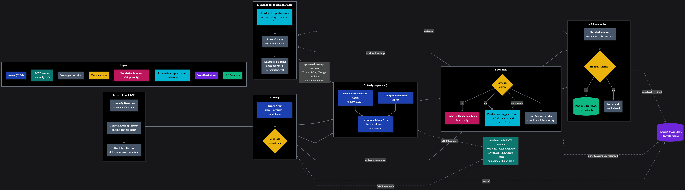
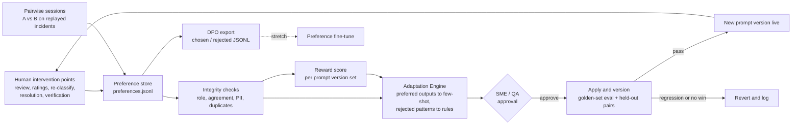

# Project Requirements: Incident Management System for Banking Domain

| Item | Detail |
|---|---|
| **Document version** | v0.11 (draft) |
| **Status** | In review. Open items: post-evaluation target review (OI-8), adaptation pattern-detection threshold (OI-12), confidence-gate threshold (OI-16), severity rule thresholds (OI-17), reviewer agreement rule for preference labels (OI-18), DeepEval judge model (OI-22), MCP 2.x upgrade (OPS-3). See Section 18 |
| **Supersedes** | v0.10 |
| **Next artifact** | Architecture Specification v1.5 (aligned with this version). Next step: code generation Phase 2 (data) |

### Version history

| Version | Change summary |
|---|---|
| v0.1 | Initial requirements: problem statement, personas, tech stack, logging, folder structure |
| v0.2 | Added scope, trigger/input definition, output specification, functional requirements, agent roles, data requirements and synthetic scenarios, evaluation approach, non-functional requirements, guardrails, assumptions and phasing |
| v0.3 | Applied decisions on OI-1 to OI-9: LangFuse adopted for tracing; `sentence-transformers` removed; single `src/config.py`; single `deployment/requirements.txt`; real banking source documents; agents renamed to match roles; dependency-verification procedure defined |
| v0.4 | Confirmed DeepEval and LangFuse's distinct roles (OI-10a); moved the reviewer-feedback loop that grows the golden dataset into MVP scope (FR-27 to FR-29) |
| v0.5 | Resolved OI-10b (LangFuse Cloud) and OI-11 (Core/Router merged, classification as an internal function); added the full Adaptive Behavior capability (feedback signals, adaptation engine, before/after comparison, change explanation) |
| v0.6 | Added a dedicated Memory Architecture (Section 10.3): working memory design, four-layer long-term memory model, retention table, git-commit-before-session-end rule; added episodic memory as a guarded stretch feature (FR-35, OI-13) |
| v0.7 | Adopted LangGraph as the orchestration engine (OI-14); added the `SYSTEM_ERROR` output status (OI-15, FR-36) |
| v0.8 | **Adopted the EventHub AIOps v2 architecture (Section 10, OI-19).** Four LLM agents (Triage, Root Cause Analysis, Change Correlation, Recommendation) replace the six v0.7 agents. Deterministic services now own detection, alert correlation and dedup, redaction, severity, paging and notification. Added a critical fast path that never waits on an LLM, an LLM-down fallback, a confidence gate, and a close-and-learn stage that indexes only human-verified resolutions. **Added the Human Feedback and RLHF loop** (Section 12.6, FR-57 to FR-64): structured ratings, pairwise preferences, a reward score per prompt version, preference-driven adaptation, and a DPO-format export. **Expanded safety guardrails** into a layered model (Section 14, FR-65 to FR-69). **Added a dedicated Streamlit UI section** (Section 15, FR-70). Paging, ticketing and notification are simulated through mock adapters (OI-20). Folder structure rebuilt on the Multi-Agent Blueprint layout (Section 17). Partly resolved OI-13. **Review updates:** Section 5 renamed to Project Team Roles and separated from the new user personas in Section 6.1, with a demo role mapping; Severity Rules Engine defined (Section 10.6); log evidence chain and evidence report for feedback and adaptation (Section 16.1, FR-71); Section 12.5 example corrected so it stays within adaptation scope. **Aligned with Architecture Spec v1.2 (ALIGN-1 to ALIGN-4):** prompt versions stored in `data/prompt_versions.json` (Sections 5, 10.3.2, 10.3.4, 13.6, 17); new data files, folders and `scripts/` added to Section 17; `live` and `evaluation` run modes (Sections 7.9, 8.1, 10.4); library versions updated to current releases, `langchain` meta-package removed (Sections 11, 11.1, 11.3, 18.2, 19). **Vocareum check (2026-10-06):** Python set to 3.10 to match Vocareum, with `numpy==2.2.6` and `pandas==2.3.3`; A-8 confirmed; OPS-1 added for Streamlit behind Vocareum's inbound proxy |
| v0.9 | **Phase 0 smoke test results (2026-10-06), aligned with Architecture Spec v1.3 (ALIGN-5).** Pinned libraries installed on Python 3.10.11 and all 10 smoke test checks pass on the development laptop (Section 11.3). `langchain==1.4.3` pinned again, because LangFuse's LangChain integration needs it (Sections 11, 11.1). All structured LLM output uses function calling with an output cap, after strict schema mode produced runaway whitespace output (Section 13.6). DeepEval uses a custom judge, configurable through `JUDGE_MODEL` (Section 17, OI-22). The Vocareum OpenAI gateway works from outside Vocareum (OPS-2). Specification file names in `docs/` follow the versioned naming (Section 17, acceptance criterion 22) |
| v0.10 | **Added MCP for tool access (OI-23, resolved).** The read-only tools are served by an MCP server (`incident-tools`, stdio transport), and the LLM agents reach them only through it; dispatch tools are never exposed over MCP (O-13, FR-72, FR-73, Sections 10.5, 11, 14, 17, 19, 20). `mcp==1.30.0` and `langchain-mcp-adapters==0.3.2` pinned; the smoke test gains an MCP check (11 of 11 pass). **Closed OI-3 and OI-9:** the pinned libraries install and pass the smoke test on the laptop (Python 3.10.11) and in Vocareum (Python 3.10.2). **Phase 1 alignment:** `node_completed`, `feedback_candidate_discarded` and two MCP server events added to Section 16; scenario directory names and fixture IDs fixed in Section 17 |
| v0.11 | **Architecture diagrams v3:** the full and mini diagrams now show the `incident-tools` MCP server between the agents and their read-only tools, with dispatch tools as direct calls (Architecture diagrams table, Section 10.1). The v2 diagrams are removed (kept in git history), and the RLHF loop diagram is now exported as PNG. **Vocareum:** all 11 smoke test checks, including MCP, pass in Vocareum (Section 11.1) |

### Architecture diagrams

| View | File | Source |
|---|---|---|
| Mini (stage overview, v3: with MCP) | `eventhub-aiops-architecture-mini-v3.png` | `eventhub-aiops-architecture-mini-v3.mmd` |
| Full (all components, v3: with MCP) | `eventhub-aiops-architecture-full-v3.png` | `eventhub-aiops-architecture-full-v3.mmd` |
| RLHF loop (detail of stage 6) | `eventhub-aiops-rlhf-loop.png` | `eventhub-aiops-rlhf-loop.mmd` |

All files are in `docs/diagrams/`.



---

## 1. Problem Statement

In the banking domain, high-severity incidents often lead to extended Mean Time to Acknowledge (MTTA) and Mean Time to Resolve (MTTR). This causes severe financial penalties, regulatory non-compliance and erosion of customer trust.

## 2. Problem Context

During high-severity incidents, engineering teams are slowed by fragmented data silos. They cannot dynamically correlate multi-dimensional telemetry (logs, Kafka events, APIs, DB/infrastructure metrics, network data and deployments) with real-time human sentiment (customer complaints). Because these data points exist in isolation, engineers must piece together the timeline manually, which delays acknowledgement and resolution.

The bank's event-streaming platform (**EventHub**, built on Kafka with Kafka Connect, Schema Registry and ACL-based access control) sits in the path of payments, ledger updates and customer notifications. Failures on this platform often show up first as symptoms in other services, so the system must reason across both the platform and the services that depend on it.

## 3. Primary Goal and Objectives

**Primary goal:** Develop an AI-based system that correlates data from multiple sources and provides an evidence-backed recommendation for issue resolution.

**Objectives**

| ID | Objective |
|---|---|
| O-1 | Reduce the manual effort of assembling an incident timeline by automatically merging all telemetry sources and customer complaints into one time-ordered view |
| O-2 | Produce ranked root-cause hypotheses with confidence scores and traceable evidence |
| O-3 | Recommend resolution actions grounded in existing runbooks and past incident postmortems |
| O-4 | Keep a human in control: the system advises, and an engineer reviews and approves |
| O-5 | Demonstrate measurable quality through DeepEval metrics, tracked and visualized in LangFuse |
| O-6 | Continuously improve the golden dataset through a feedback loop, where reviewer edits and rejections become candidate test cases validated by the SME |
| O-7 | Demonstrate adaptive behavior: collect feedback signals (explicit and implicit), apply human-approved changes to agent behavior in response, show a measurable before/after difference, and explain in plain language why each change was made |
| O-8 | Maintain a clear memory architecture that separates short-term working state (discarded after every investigation) from long-term knowledge, evaluation and behavioral memory (which must persist reliably, including across the ephemeral Vocareum lab sessions used for the demo) |
| O-9 | Orchestrate the multi-agent pipeline as an explicit, inspectable state graph, so parallel evidence gathering, conditional loop-backs, retries and failure handling are structural properties of the graph rather than ad hoc control flow |
| O-10 | **NEW v0.8:** Shorten time to acknowledge for critical incidents: paging and severity decisions are deterministic, so they never wait on an LLM call and still work when the LLM is unavailable |
| O-11 | **NEW v0.8:** Learn from human preferences (RLHF at the prompt level): collect structured ratings and pairwise preferences at every human intervention point, turn them into a reward signal per prompt version, and use that signal to drive human-approved improvements |
| O-12 | **NEW v0.8:** Apply layered safety guardrails across input, tools, outputs, dispatch and learning, so no LLM output can trigger an action, leak data or corrupt the learning loop without a human gate |
| O-13 | **NEW v0.10:** Demonstrate the Model Context Protocol (MCP) as the standard interface between agents and tools: the LLM agents discover and call the read-only tools through an MCP server, and the server's tool list is itself a safety boundary because it contains no tool that can page, ticket or notify |

## 4. Scope

### 4.1 In scope (capstone)

- **Batch snapshot analysis.** The system analyses a fixed snapshot of data for an incident window. It does not consume live streams. The Anomaly Detection Service replays the snapshot to raise anomaly events (Section 6.2).
- **Advisory only.** The system recommends actions. It never executes remediation.
- Synthetic banking data for 5 incident scenarios (Section 9.4), extended with EventHub platform telemetry (Section 9.2).
- Two data paths: semantic retrieval (FAISS) for documents and tool-based structured queries for telemetry.
- Multi-agent orchestration with structured, cited outputs, implemented as a LangGraph `StateGraph` (Section 10.4).
- **NEW v0.8:** Deterministic intake services: anomaly detection, alert correlation and dedup, and PII/secret redaction (Section 10.2).
- **NEW v0.8:** A deterministic Severity Rules Engine, a critical fast path, and an LLM-down fallback (FR-41 to FR-43).
- **NEW v0.8:** Simulated dispatch: paging, ITSM ticket creation and assignment, and chat/email notification through mock adapters that write to a local outbox (OI-20).
- **NEW v0.8:** A close-and-learn stage: resolution notes, human verification of the root cause, and indexing of verified resolutions into the past-incident knowledge base (FR-54, FR-55).
- Human-in-the-loop review of every recommendation, feeding a feedback loop that grows the golden dataset.
- **NEW v0.8:** A Human Feedback and RLHF loop: ratings, pairwise preferences, a reward score per prompt version, preference-driven adaptation and a DPO-format export (Section 12.6).
- An adaptation engine that turns accumulated feedback into human-approved changes to agent prompts or retrieval configuration, with before/after comparison and a recorded explanation.
- An explicit memory architecture (Section 10.3).
- An explicit `SYSTEM_ERROR` output state for unrecoverable failures (Section 8.1).
- Streamlit UI (Section 15), logging, layered guardrails (Section 14), DeepEval metrics and LangFuse Cloud tracing/dataset tracking.
- **NEW v0.10:** An MCP server (`incident-tools`) that serves the read-only tools to the LLM agents over the stdio transport, with an in-process fallback (FR-72, FR-73). Out of scope for MCP: remote transports, authentication, MCP resources and prompts.

### 4.2 Out of scope

- Real-time streaming ingestion and live alert subscriptions
- Auto-remediation or any write action against systems (restarts, rollbacks, config changes, offset resets, ACL changes)
- Integration with real production systems, ticketing tools or paging tools (PagerDuty, Opsgenie, ServiceNow, Jira, Slack, Teams, email). **v0.8:** these are represented by mock adapters with the same interface (OI-20)
- Real customer data. Only synthetic data is used
- **Model fine-tuning or any change to model weights in MVP.** RLHF in this project works at the prompt level (Section 12.6). The DPO-format preference export makes a later fine-tuning run possible, but running it is stretch only (Section 4.4)
- Formal MTTA/MTTR measurement in production (proxies are used instead, Section 12)
- Fully automatic promotion of feedback into the golden dataset, or fully automatic application of an adaptation. Both always require SME or Evaluation Engineer sign-off
- Self-hosting LangFuse (resolved: LangFuse Cloud is used, Section 11.2)
- Cross-incident conversational memory (Section 10.3)
- Automatic retry or recovery beyond the bounded retry policy (Section 13.6)

### 4.3 Assumptions

| ID | Assumption |
|---|---|
| A-1 | All telemetry is available as JSON/CSV files sharing a common time base (ISO 8601, UTC) |
| A-2 | Service names are consistent across all sources (the shared `service` field) |
| A-3 | Synthetic data is realistic enough to demonstrate correlation, including noise and red herrings |
| A-4 | Runbooks, postmortems and service documentation are authored or validated by the Domain Expert (SME) |
| A-5 | One incident is investigated at a time. **v0.8:** the alert correlation service may still receive many anomaly events for that one incident, and must group them (FR-38) |
| A-6 | An OpenAI API key and a LangFuse Cloud project (public/secret key) are available, and outbound calls to both contain only masked data. **v0.8:** the course provides a Vocareum gateway key (`voc-…`) that works only through `https://openai.vocareum.com/v1`; the gateway address is configured through `OPENAI_BASE_URL`, so switching between the gateway key and a personal OpenAI key changes only `.env` (OPS-2) |
| A-7 | During the capstone timeline, enough reviewer edits/rejections and preference labels will be generated (through demo runs, deliberate test variants and scheduled comparison sessions) to exercise the feedback loop, the RLHF loop and the adaptation engine at least once per scenario |
| A-8 | The Vocareum lab environment used for the demo permits outbound HTTPS to the LangFuse Cloud API endpoint. **Confirmed 2026-10-06:** LangFuse Cloud (EU) health and key authentication return 200 from Vocareum, from both `curl` and Python; OpenAI and PyPI are also reachable; no outbound proxy (Architecture Spec v1.2, Section 0.2.1). Re-check once in the final demo session |
| A-9 | The Vocareum lab environment may reset or tear down between sessions, so anything meant to be long-term memory (golden dataset, feedback candidates, preference store, adaptation log, prompt version history, verified-resolution index) is only durable if it is committed to git (or otherwise exported) before a session ends (Section 10.3, Section 13.6) |
| A-10 | LangGraph's own state-checkpointing feature is not relied upon as a durability mechanism across sessions; it is used only for in-run retry/resume behavior |
| A-11 | **NEW v0.8:** Team members play the human roles in the demo: Incident Escalation Team, Production Support, SME and Evaluation Engineer. The role is recorded with every human decision |

### 4.4 Phasing

| Phase | Content |
|---|---|
| **MVP** | Anomaly replay and manual alert/free-text intake; alert correlation and dedup; redaction; the 4 LLM agents and deterministic services in Section 10.2, orchestrated as a LangGraph `StateGraph`; the telemetry, EventHub platform, complaint, knowledge and dispatch tools in Section 10.5, with the read-only tools served to the agents by the `incident-tools` MCP server; Severity Rules Engine with critical fast path and LLM-down fallback; confidence gate; simulated paging, ITSM and notification; structured output including `SYSTEM_ERROR`; layered guardrails; human review (approve/edit/reject) with ratings; resolution and verification; indexing of verified resolutions; logging; LangFuse Cloud tracing and dataset tracking; DeepEval metrics; 5 scenarios; reviewer-feedback loop; RLHF loop with pairwise comparison sessions and reward score; adaptation engine triggered manually via a script; DPO-format export; memory architecture with the git-commit-before-session-end rule; Streamlit multipage UI |
| **Stretch** | Cost and latency dashboard in UI; simulated streaming replay of a scenario; comparison against a single-prompt baseline; incident-report export (PDF/MD); automatic (CI-style) re-run of the adaptation scan and DeepEval; system-generated postmortems (FR-35); LangGraph checkpoint persistence for mid-run resume; **an OpenAI preference fine-tuning (DPO) run on the exported preference dataset, evaluated against the prompt-only baseline on the golden set**; **best-of-n reranking of candidate recommendations using the reward score** |

## 5. Project Team Roles and Deliverables

This section lists the people who **build** the system (the capstone team). The people who **use** the system are the user personas in Section 6.1. The two lists are deliberately different. During the demo, team members also play the user personas; the mapping is in Section 6.1.1.

| Team role | Responsibility | Key deliverables |
|---|---|---|
| **AI Architect** | Designs the overall AI architecture; selects models and approaches | Architecture specification; agent design (`docs/agent_design.md`); engineering decisions log; owns the memory architecture design (Section 10.3); owns the LangGraph graph design (Section 10.4); **owns the layered guardrail model (Section 14) and the human-intervention map (Section 13.5)** |
| **Data Engineer** | Builds data pipelines, ingestion, transformation, vector database, knowledge base and data flow | Synthetic telemetry generator and files, **now including EventHub platform telemetry**; shared schema and data dictionary; document loader, chunker, embedder and FAISS index; telemetry query tools' data layer; **anomaly detection service, alert correlation and dedup service, runbook re-index job, verified-resolution indexer**; dependency verification (with LLM Engineer) |
| **LLM Engineer** | Works with LLMs, prompting, RAG, agents and structured outputs | Agent implementations (Triage, RCA, Change Correlation, Recommendation); base prompt templates (`prompts.py`) and the versioned prompt additions in `data/prompt_versions.json`; output schema validation including `SYSTEM_ERROR`; tool wiring and the tool access policy; guardrail integration; LangFuse tracing instrumentation; co-owns `adaptation_engine.py` **and the preference-driven adaptation path**; implements the LangGraph state schema |
| **Evaluation/QA Engineer** | Tests the complete AI application and integrations | Golden dataset and rubric; DeepEval harness; LangFuse dataset runs and score push; feedback-loop pipeline; **preference store, reward aggregation, pairwise comparison sessions, DPO export**; co-owns `adaptation_engine.py`; evaluation report; integration and regression tests, **including fast-path latency, dedup, dispatch routing and LLM-down fallback tests**; tests the `SYSTEM_ERROR` path |
| **Domain Expert (SME)** | Provides domain knowledge and validates AI outputs | Validated runbooks, postmortems and service docs; ground-truth root causes per scenario; **severity rule thresholds (OI-17)**; review of outputs; PII and regulatory guidance; sign-off on feedback candidates and adaptations; **verification of resolved root causes before indexing (FR-55); tie-break on disputed preference labels (FR-64)** |

## 6. Users, Trigger and Input Definition

### 6.1 User personas

Each persona matches a human role in the architecture diagrams. The intervention points (H-1 to H-10) are defined in Section 13.5, and the UI pages in Section 15.

| Persona | Where in the architecture | What they do | Intervention points | Main UI pages |
|---|---|---|---|---|
| **On-call engineer / SRE** | Stage 1, manual input | Starts an investigation from detection replay, alert JSON or free text, and follows its progress | (none; starts runs) | Investigate |
| **Incident Escalation Team** | Stage 4, Major (S1/S2) | Acknowledges simulated pages, investigates (including "Needs human RCA" cases), reviews and rates the recommendation, confirms high-risk actions, records the resolution | H-1, H-2, H-3, H-5, H-6 | Incident, Outbox, Resolve and Verify |
| **Production Support Team** | Stage 4, Low/Medium (S3/S4) | Works the simulated ITSM queue, applies runbook fixes, reviews and rates the recommendation, re-classifies to Major when needed, records the resolution | H-2, H-3, H-4, H-5, H-6 | Incident, Outbox, Resolve and Verify |
| **Incident commander / engineering manager** | Stage 4, Major incidents | Reads the stakeholder summary; approves or rejects the recommendation for Major incidents | H-3 | Incident |
| **Domain Expert (SME), as a user** | Stages 5 and 6 | Verifies root causes before indexing, reviews feedback candidates, breaks ties on pairwise labels, approves adaptations | H-7, H-8, H-9 (tie-break), H-10 | Resolve and Verify, Review Queue, Feedback and RLHF, Adaptation History |
| **Evaluation Engineer, as a user** | Stage 6 | Runs pairwise sessions, reads reward scores, approves adaptations, runs evaluations | H-9, H-10 | Feedback and RLHF, Adaptation History, Evaluation |

#### 6.1.1 Who plays each persona in the demo

| Team role (Section 5) | Persona(s) played in the demo |
|---|---|
| AI Architect | Incident commander |
| Data Engineer | On-call engineer / SRE |
| LLM Engineer | Incident Escalation Team; second pairwise reviewer |
| Evaluation/QA Engineer | Evaluation Engineer; Production Support Team |
| Domain Expert (SME) | SME |

The persona selected in the UI is recorded as `reviewer_role` on every human decision (A-11). One person may play two personas, but the same person must not provide both labels for one pairwise comparison (FR-64).

### 6.2 Trigger: detection replay or manual input

**v0.8 change:** the architecture starts at detection, not at a human pasting an alert. Both paths are supported and converge at the alert correlation service.

| Input mode | Description | Example |
|---|---|---|
| **Detection replay** (**NEW v0.8**) | The user selects a scenario snapshot in the UI. The Anomaly Detection Service replays it and emits anomaly events | Selecting SC-02 produces broker-failure, consumer-lag and notification-delay anomalies |
| **Pasted alert JSON** | Mimics a monitoring-tool alert | `{"alert_id":"ALR-1042","service":"payments-service","severity":"critical","timestamp":"2026-03-14T10:05:00Z","summary":"Payment API error rate > 15%"}` |
| **Free-text description** | Engineer types what they observe | "Payments failing since 10:05, customers seeing timeouts on fund transfer" |
| **Time window (optional)** | Start and end of analysis window | `2026-03-14T09:30Z` to `2026-03-14T10:30Z` |

**Customer complaints are a data source, not a trigger.** They are read through the `query_complaints` tool by the Triage and RCA agents.

### 6.3 Incident Object (normalized)

| Field | Type | Notes |
|---|---|---|
| `incident_id` | string | Generated (for example `INC-YYYYMMDD-NNN`); carried through every log line and LangFuse trace |
| `run_id` | string | Unique per investigation run |
| `idempotency_key` | string | **NEW v0.8.** Hash of the root service and the time bucket; repeated anomaly events with the same key update the same incident (FR-38) |
| `input_mode` | enum | `detection_replay`, `alert_json` or `free_text` |
| `raw_input` | string | Original input after PII masking |
| `anomaly_events` | list | **NEW v0.8.** Grouped anomaly events from detection (empty for manual input) |
| `reported_service` | string, optional | From alert or extracted from text |
| `reported_severity` | enum, optional | From alert, if present. Informational only; never used as the final severity |
| `reference_time` | datetime (UTC) | Alert timestamp, first anomaly time, or time extracted from text |
| `window_start`, `window_end` | datetime (UTC) | User-supplied. If omitted, default is `reference_time` minus 60 min to plus 15 min |
| `hints` | list, optional | Symptoms or keywords extracted from the input |

**Normalization rules**
- If alert JSON is malformed or missing required fields (`service`, `timestamp`), the UI shows a validation error. It does not guess.
- If free text has no discernible time, the system asks for a time window rather than assuming one.
- Times without a timezone are interpreted as UTC and flagged in the output.

## 7. Functional Requirements

FR-01 to FR-36 are carried forward from v0.7, updated where the v0.8 architecture changes them. FR-37 onward are new in v0.8.

### 7.1 Detection, intake and input handling

| ID | Requirement | Priority |
|---|---|---|
| FR-01 | Accept detection replay, pasted alert JSON or free-text description, with an optional time window | Must |
| FR-02 | Validate and normalize input into an Incident Object | Must |
| FR-03 | Mask PII and secrets in all input and telemetry excerpts before any LLM call, through the Redaction Filter (Section 13.3) | Must |
| FR-04 | Detect prompt-injection attempts in input and retrieved content (Section 14) | Must |
| FR-37 | **NEW.** The Anomaly Detection Service (statistical and threshold rules, no LLM) replays a scenario snapshot and emits anomaly events with `service`, `metric`, `observed`, `baseline`, `timestamp` and an `evidence_id` | Must |
| FR-38 | **NEW.** The Alert Correlation and Dedup Service groups anomaly events that share a root service or a dependency path (Section 9.3) within a time bucket into **one** incident, using an idempotency key. A repeated event updates the existing incident; it never creates a second incident, ticket or page | Must |
| FR-39 | **NEW.** Create an Incident State Store record when an incident is created, and append a record at every lifecycle change (paged, assigned, reviewed, re-classified, resolved, verified) (Section 10.3.2) | Must |

### 7.2 Triage and severity

| ID | Requirement | Priority |
|---|---|---|
| FR-40 | **NEW.** The Triage Agent makes one structured LLM call that returns `issue_class` (Section 10.2), `proposed_severity`, `affected_services`, `confidence` and supporting `evidence_ids`. It merges the v0.7 classification step and the severity estimate into one agent | Must |
| FR-41 | **NEW.** The Severity Rules Engine (deterministic) decides the final severity from measurable signals: customer-facing error rate, failed-transaction share, complaint volume, consumer lag, offline or under-replicated partitions, and regulatory flags. It runs a **first pass on incident creation** (no LLM input) and a **second pass** after Triage adds issue class and affected services. Rules override the LLM proposal; every disagreement is logged and captured as a `severity_disagreement` feedback signal. Rules, inputs and semantics are defined in Section 10.6 | Must |
| FR-42 | **NEW. Critical fast path.** If the first rules pass returns S1, the workflow dispatches a simulated page immediately, before any LLM call completes, and the investigation continues in parallel. Target: page within 10 s of incident creation | Must |
| FR-43 | **NEW. LLM-down fallback.** If the LLM is unavailable, times out after retries, or is disabled by the kill switch (FR-68), the workflow still computes rules-based severity, creates the ITSM ticket and pages or assigns as the rules dictate. The run then ends as `SYSTEM_ERROR` with the `rules_severity` and `dispatch` blocks populated (Section 8.1) | Must |
| FR-44 | **NEW.** ITSM create/update calls go through the mock ITSM adapter and are idempotent on the incident's idempotency key | Must |
| FR-14 | Estimate severity (S1 to S4) and affected services, including customer-impact evidence. **v0.8:** satisfied by FR-40 (proposal) and FR-41 (decision) | Must |

**Severity mapping**

| Level | Name | Group | Dispatch |
|---|---|---|---|
| S1 | Critical | Major | Critical fast path page (FR-42), then full investigation |
| S2 | High | Major | Page at the final severity gate (FR-51) |
| S3 | Medium | Low/Medium | ITSM assignment to Production Support |
| S4 | Low | Low/Medium | ITSM assignment to Production Support |

### 7.3 Evidence gathering and analysis

| ID | Requirement | Priority |
|---|---|---|
| FR-05 | Query each telemetry source (logs, Kafka events, API metrics, DB/infra metrics, network, change records) by service and time window through registered tools | Must |
| FR-06 | Each tool returns records with a stable `evidence_id`, timestamp, service and source | Must |
| FR-07 | Analyse customer complaints in the window: volume over time, topic clusters, sentiment, affected channel, estimated customer impact and earliest complaint signal. **v0.8:** provided by the `query_complaints` tool, which returns pre-aggregated clusters, used by the Triage and RCA agents | Must |
| FR-08 | Retrieve relevant runbooks, past postmortems, verified past resolutions, service documentation and regulatory notes from FAISS through `search_knowledge_base` | Must |
| FR-09 | Use the service dependency map to include upstream and downstream services and estimate blast radius | Should |
| FR-10 | Build a unified, time-ordered timeline that merges all telemetry events and complaint spikes, tagged by source and service | Must |
| FR-11 | Detect anomalies against baseline. **v0.8:** first pass by the Anomaly Detection Service (FR-37); the RCA Agent may confirm or add anomalies from its own tool calls | Must |
| FR-12 | Correlate anomalies with deployments and configuration changes in the preceding window. **v0.8:** owned by the Change Correlation Agent, covering releases, config, ACL, schema and connector changes | Must |
| FR-13 | Generate ranked root-cause hypotheses, each with a confidence score, supporting evidence and contradicting or missing evidence | Must |
| FR-45 | **NEW.** The RCA Agent and the Change Correlation Agent run in parallel (LangGraph fan-out). Their outputs join before the Recommendation Agent | Must |
| FR-46 | **NEW.** The RCA Agent picks tools by issue class, may run independent tool calls in parallel, and is limited to a tool-call budget (default 8 calls) and one follow-up round | Must |
| FR-47 | **NEW.** EventHub platform tools are available to the RCA Agent: Connect status, ACL list and audit, Schema Registry and TLS status, cluster quorum (ZooKeeper/KRaft), and the topology/blast-radius query | Should |

### 7.4 Recommendation, output and failure states

| ID | Requirement | Priority |
|---|---|---|
| FR-15 | Produce recommended actions, each linked to a runbook or postmortem citation and labelled with risk level | Must |
| FR-16 | Produce a stakeholder summary in plain language. **v0.8:** the Recommendation Agent emits structured summary fields; the Notification Service renders them through templates (the v0.6 Summarizer agent is removed) | Must |
| FR-17 | Validate output against the schema (Section 8). Every claim must reference at least one valid `evidence_id`, and every action must cite a document | Must |
| FR-18 | If evidence is insufficient, return an explicit `INSUFFICIENT_EVIDENCE` result with suggested data to collect. Do not fabricate | Must |
| FR-36 | If a tool call or LLM call fails unrecoverably after the bounded retry policy is exhausted (Section 13.6), or an unhandled exception occurs, terminate with status `SYSTEM_ERROR`: no recommendation body is produced, the failure is written in full to `error.log` and the LangFuse trace, and the UI shows a plain "investigation could not complete" state | Must |
| FR-48 | **NEW.** The Recommendation Agent returns root cause, actions, a confidence score, evidence citations and summary fields in one structured output | Must |
| FR-49 | **NEW. Confidence gate.** If the top hypothesis confidence is below the threshold (default 0.5, OI-16), the output is flagged `needs_human_rca: true`. It is still dispatched, with a distinct "Needs human RCA" banner in the UI, notification and ITSM ticket | Must |
| FR-50 | **NEW. Bounded re-score.** If the Recommendation Agent's evidence changes a severity input (for example, it confirms customer-facing failures that the first pass did not see), the Severity Rules Engine is re-run **at most once** per run | Must |

### 7.5 Respond and dispatch

| ID | Requirement | Priority |
|---|---|---|
| FR-51 | **NEW. Final severity gate (rules).** Major (S1/S2): simulated page to the Incident Escalation Team (S1 is already paged by FR-42; the gate attaches the recommendation to that page instead of paging again). Low/Medium (S3/S4): simulated ITSM assignment to the Production Support queue, with summary and recommended fix | Must |
| FR-52 | **NEW. Notification Service (non-LLM).** Looks up stakeholders by exact match in `data/stakeholders.json`, renders templated messages, and sends them through mock chat and email adapters. Major: incident channel plus stakeholder email. Low/Medium: team channel only. Notifications are sent **after** the severity gate and are deduplicated per incident | Must |
| FR-53 | **NEW. Re-classification.** Production Support can re-classify an incident as Major from the UI, with a mandatory reason. The incident re-enters the final severity gate and is paged. The re-classification is captured as a feedback signal | Must |
| FR-20 | The system exposes no capability to execute actions on any system. **v0.8:** dispatch tools (page, ticket, notify) write only to the local outbox and mock ITSM store, and are callable only by deterministic workflow nodes, never by an LLM agent (FR-66) | Must |

### 7.6 Close and learn

| ID | Requirement | Priority |
|---|---|---|
| FR-54 | **NEW.** The resolver records resolution notes: actual root cause, actions taken, whether the recommended fix worked (`worked`, `partly`, `did_not_work`, `not_tried`), and resolution time | Must |
| FR-55 | **NEW. Verification gate.** Only a resolution whose root cause is confirmed by a human (SME or escalation lead) is indexed into the past-incidents knowledge base (`knowledge/raw/postmortems/verified/`) and re-embedded into FAISS. Unverified resolutions are stored but never indexed | Must |
| FR-56 | **NEW.** A runbook re-index job (script, run on demand or on a schedule) re-embeds changed documents and records a `last_verified` date per document. Citations to documents older than the staleness limit (default 180 days) are flagged in the output | Should |
| FR-35 | **(Stretch)** System-generated postmortem written after an `APPROVED` investigation, tagged `source: system_generated` and `citation_status: unverified`, excluded from citation until the SME promotes it | Should |

### 7.7 Human-in-the-loop, observability, evaluation and feedback loop

| ID | Requirement | Priority |
|---|---|---|
| FR-19 | Every recommendation starts as `PENDING_REVIEW`. The reviewer can Approve, Edit or Reject, with a reason | Must |
| FR-22 | Log all agent activity, errors and evaluation metrics to the three log files (Section 16) | Must |
| FR-23 | Run the evaluation harness (DeepEval metrics plus programmatic checks) on the golden dataset and report metrics (Section 12) | Must |
| FR-24 | Show latency per stage and token/cost per investigation in the UI | Should |
| FR-25 | Emit a LangFuse trace for every investigation run, with a span per graph node and per tool call, LLM generations with token usage, and DeepEval's scores attached (Section 11.2) | Must |
| FR-26 | If LangFuse is unreachable, the investigation still completes. The failure is written to `error.log`, and DeepEval scores are still written to `eval.log` | Must |
| FR-27 | Every Edit or Reject decision is captured as a **feedback candidate**: the original Incident Object, the system's output, the reviewer's correction or reason, and the evidence used, linked to `incident_id`, `run_id` and `langfuse_trace_id` | Must |
| FR-28 | Provide a review queue (UI page) where the SME inspects feedback candidates and either promotes a candidate into `data/eval_rubric.json` and `data/test_inputs.json` or discards it with a reason. A promoted candidate is also added to the LangFuse dataset | Must |
| FR-29 | A promoted feedback candidate is versioned so evaluation runs can be compared before and after each promotion | Should |

### 7.8 Adaptive behavior

Full design in Section 12.5.

| ID | Requirement | Priority |
|---|---|---|
| FR-30 | Tag every feedback candidate with a structured **issue type** (`severity_error`, `root_cause_error`, `citation_error`, `missing_evidence`, `retrieval_miss`, `triage_class_error`, `change_correlation_miss`, `verbosity`), assigned or confirmed by the reviewer or SME | Must |
| FR-31 | Scan promoted feedback candidates, preference data (Section 12.6) and recent evaluation history for a **recurring pattern**, and propose one candidate adaptation per pattern: a prompt-rule addition, a few-shot example addition, or a retrieval alias/metadata update | Must |
| FR-32 | Require explicit SME or Evaluation Engineer approval before any proposed adaptation is applied | Must |
| FR-33 | On approval: snapshot the targeted metric(s) (**before**), apply the change and bump the version, re-run the DeepEval harness on the full golden set (**after**), and confirm no other tracked metric regressed beyond tolerance | Must |
| FR-34 | Record every adaptation event in `data/feedback/adaptation_log.json` with trigger, change, before/after metrics, approver and plain-language explanation; surface it in the UI and in `docs/evaluation_report.md` | Must |
| FR-71 | **NEW v0.8. Log evidence.** Every feedback, preference and adaptation event is logged with the link fields in Section 16.1, and `evidence_report.py` produces a per-adaptation evidence report from the logs that shows the complete chain E-1 to E-10, or marks missing steps | Must |

### 7.9 Human feedback and RLHF

Full design in Section 12.6.

| ID | Requirement | Priority |
|---|---|---|
| FR-57 | **NEW.** Capture structured human feedback at every human intervention point listed in Section 13.5 (review, confidence-gate hand-off, re-classification, resolution, verification, SME decisions), linked to `incident_id`, `run_id`, `langfuse_trace_id` and the prompt version set | Must |
| FR-58 | **NEW. Ratings.** On every review, the reviewer rates the output 1 to 5 on four dimensions: root-cause correctness, action usefulness, severity appropriateness, summary clarity. Rating is required for Edit and Reject, optional for Approve | Must |
| FR-59 | **NEW. Pairwise preference sessions.** For golden or replayed incidents, the system generates two candidate recommendations (current vs. candidate prompt version, or two samples from the current version). The reviewer picks the preferred one, or marks a tie, with a reason. Pairwise sessions run on replayed incidents in `evaluation` run mode (Section 10.4), never on a live investigation's dispatched output | Must |
| FR-60 | **NEW. Preference store.** All ratings, preferences and outcome signals are appended to `data/feedback/preferences.jsonl` with the schema in Section 12.6, after the PII re-check | Must |
| FR-61 | **NEW. Reward score.** Compute a reward score per prompt version set from ratings, approval rate, pairwise win rate and verified resolution outcomes (Section 12.6), shown in the UI and attached to LangFuse as a score | Must |
| FR-62 | **NEW. Preference-driven adaptation.** The adaptation engine uses preference data: outputs that reviewers consistently prefer become few-shot candidates, and consistently rejected patterns become prompt-rule candidates. All of FR-32 to FR-34 apply, **plus** a held-out pairwise win-rate check (Section 12.6) | Must |
| FR-63 | **NEW. DPO export.** Export preference pairs as JSONL (`prompt`, `chosen`, `rejected`, metadata) to `data/feedback/dpo_export/` for a possible future fine-tuning run | Should |
| FR-64 | **NEW. Feedback integrity.** Every human signal records the reviewer role. A pairwise label counts toward adaptation only if two reviewers agree or the SME breaks the tie (OI-18). Contradictory or duplicate signals are flagged, not silently merged | Must |

### 7.10 Safety guardrails

Full design in Section 14.

| ID | Requirement | Priority |
|---|---|---|
| FR-65 | **NEW. Action policy.** Every recommended action is checked against `data/action_policy.json`. Destructive operations (for example deleting a topic, resetting consumer offsets, removing an ACL, purging data, disabling TLS, force-failing a broker) are labelled `risk_level: high`, require a runbook citation, cannot be the first step of a plan, and need a two-step confirmation in the UI. Actions on the deny list are removed and flagged | Must |
| FR-66 | **NEW. Tool access policy.** LLM agents may call only registered read-only tools. Dispatch tools (page, ITSM, chat, email) are callable only by deterministic workflow nodes. Any attempt by an agent to call an unregistered or dispatch tool is blocked and logged | Must |
| FR-67 | **NEW. Output tone check.** Stakeholder summaries are checked for speculative blame, unverified customer-impact claims and disallowed wording before they are rendered | Should |
| FR-68 | **NEW. Kill switch.** A config flag (`LLM_ENABLED=false`) puts the system into rules-only mode (FR-43) without a code change | Must |
| FR-69 | **NEW. Dispatch rate limit.** At most one page per incident per 15 minutes, and notification storm suppression across incidents sharing a root service | Must |

### 7.11 User interface

| ID | Requirement | Priority |
|---|---|---|
| FR-21 | Streamlit UI shows: intake form, agent progress per graph node, unified timeline, hypotheses, evidence drill-down, recommendations, stakeholder summary and review controls | Must |
| FR-70 | **NEW.** The Streamlit app is a multipage app with the pages defined in Section 15, including the simulated outbox, review queue, RLHF comparison and Adaptation History | Must |

### 7.12 Tool access through MCP (NEW v0.10)

| ID | Requirement | Priority |
|---|---|---|
| FR-72 | **NEW.** An MCP server named `incident-tools` (`src/mcp_server/server.py`, stdio transport) exposes exactly the read-only tools in Section 10.5 (telemetry, EventHub platform, complaints, dependencies, knowledge-base search), backed by the same implementations as the in-process registry. It never exposes a dispatch tool (page, ITSM, chat, email) or `lookup_stakeholders`. The LLM agents obtain their tools from this server through the MCP client | Must |
| FR-73 | **NEW.** A configuration switch `TOOL_TRANSPORT` selects `mcp` (default) or `inprocess`. Both return identical results for the same call. If the MCP server cannot start, the run uses the in-process path, logs `mcp_server_error`, and flags the run; a tool call that fails over MCP mid-run follows the normal retry and `SYSTEM_ERROR` handling (Section 13.6) | Must |

The registry's own access policy (FR-66) remains in force for both transports, so a dispatch tool is blocked twice: it is absent from the MCP server, and the registry refuses it to agents.

## 8. Output Specification

### 8.1 Output fields

| Field | Description |
|---|---|
| `incident_id`, `run_id` | Identifiers |
| `status` | `PENDING_REVIEW`, `APPROVED`, `EDITED`, `REJECTED`, `INSUFFICIENT_EVIDENCE`, or `SYSTEM_ERROR` |
| `incident_state` | **NEW v0.8.** Lifecycle, separate from review status: `OPEN`, `PAGED`, `ASSIGNED`, `RESOLVED`, `CLOSED_VERIFIED`, `CLOSED_UNVERIFIED` |
| `issue_class` | **NEW v0.8.** From the Triage Agent (Section 10.2) |
| `severity` | `level` (S1 to S4), `rationale`, **`source: rules`**, **`llm_proposed_level`**, **`rules_fired[]`**, **`rescored` (bool)**. Absent when `status` is `SYSTEM_ERROR` (see `rules_severity`) |
| `affected_services` | List of services with role (`origin`, `impacted`, `downstream`) |
| `timeline` | Ordered events: `timestamp`, `source`, `service`, `description`, `evidence_id` |
| `hypotheses` | Ranked list: `rank`, `root_cause`, `confidence` (0 to 1), `supporting_evidence[]`, `contradicting_or_missing_evidence[]` |
| `change_findings` | **NEW v0.8.** From the Change Correlation Agent: `change_id`, `change_type`, `time_before_onset`, `linked_hypothesis_rank` |
| `evidence` | Map of `evidence_id` to source file, record locator and (masked) excerpt |
| `recommended_actions` | List: `step`, `action`, `risk_level`, `runbook_citation`, `expected_effect`, `requires_approval` (always true), **`policy_flags[]`** |
| `needs_human_rca` | **NEW v0.8.** True when the confidence gate fires (FR-49) |
| `stakeholder_summary` | Plain-language summary: what happened, customer impact, current status, next update |
| `regulatory_notes` | Applicable reporting or notification considerations (from knowledge base) |
| `dispatch` | **NEW v0.8.** `paged` (bool), `page_time`, `fast_path` (bool), `itsm_ticket_id`, `assigned_queue`, `notifications[]` (channel, audience, time), `suppressed` (bool), `intended` (what would have been dispatched, in `evaluation` run mode). All values refer to the simulated outbox |
| `rules_severity` | **NEW v0.8.** Present only when `status` is `SYSTEM_ERROR` and the rules engine ran: the deterministic severity and `rules_fired[]` |
| `error_detail` | Present only when `status` is `SYSTEM_ERROR`: `failed_node`, `error_type` (now including `llm_unavailable` and `kill_switch`), `retry_count`, and a plain, non-technical message. Never includes a stack trace or raw exception text |
| `resolution` | **NEW v0.8.** Added at close: `actual_root_cause`, `actions_taken`, `fix_outcome`, `verified_by`, `verified_at` |
| `metadata` | Model, token counts, cost estimate, latency per stage, guardrail flags, timezone assumptions, `langfuse_trace_id`, `prompt_version_set`, **`reward_score_at_run`** |

**`SYSTEM_ERROR` vs. `INSUFFICIENT_EVIDENCE`** (unchanged from v0.7): `INSUFFICIENT_EVIDENCE` is a correct, evidence-grounded outcome and counts as a successful run in evaluation. `SYSTEM_ERROR` means the pipeline broke and no recommendation was reached. **v0.8 addition:** a `SYSTEM_ERROR` run may still carry `rules_severity` and `dispatch`, because those come from deterministic services that do not depend on the LLM. It still never carries a recommendation body.

### 8.2 Example (abbreviated)

```json
{
  "incident_id": "INC-20260314-001",
  "status": "PENDING_REVIEW",
  "incident_state": "PAGED",
  "issue_class": "release_regression",
  "severity": {
    "level": "S1",
    "source": "rules",
    "llm_proposed_level": "S1",
    "rules_fired": ["customer_error_rate_gt_15pct", "complaints_gt_100_in_20min"],
    "rescored": false,
    "rationale": "Fund transfers failing for ~38% of attempts; 212 complaints in 20 min"
  },
  "affected_services": [
    {"service": "payments-service", "role": "origin"},
    {"service": "mobile-app", "role": "impacted"}
  ],
  "hypotheses": [
    {
      "rank": 1,
      "root_cause": "Deployment v2.14.0 of payments-service reduced DB connection timeout, causing request failures",
      "confidence": 0.82,
      "supporting_evidence": ["DEP-0007", "LOG-0421", "API-0113"],
      "contradicting_or_missing_evidence": ["No network anomalies found (NET-0009 normal)"]
    }
  ],
  "change_findings": [
    {"change_id": "DEP-0007", "change_type": "release", "time_before_onset": "10m", "linked_hypothesis_rank": 1}
  ],
  "recommended_actions": [
    {
      "step": 1,
      "action": "Roll back payments-service to v2.13.4 after approval",
      "risk_level": "medium",
      "runbook_citation": "RB-PAY-003 §2",
      "requires_approval": true,
      "policy_flags": []
    }
  ],
  "needs_human_rca": false,
  "dispatch": {
    "paged": true, "fast_path": true, "page_time": "2026-03-14T10:05:07Z",
    "itsm_ticket_id": "MOCK-ITSM-0001", "assigned_queue": "incident-escalation",
    "notifications": [{"channel": "chat", "audience": "incident-channel", "time": "2026-03-14T10:05:41Z"}]
  },
  "stakeholder_summary": "Fund transfers are failing intermittently since 10:05 UTC following a release...",
  "metadata": {"prompt_version_set": {"triage_agent": "v1", "recommendation_agent": "v2"}}
}
```

**`SYSTEM_ERROR` with LLM-down fallback (NEW v0.8):**

```json
{
  "incident_id": "INC-20260314-007",
  "run_id": "RUN-88213",
  "status": "SYSTEM_ERROR",
  "incident_state": "PAGED",
  "rules_severity": {"level": "S1", "rules_fired": ["customer_error_rate_gt_15pct"]},
  "dispatch": {"paged": true, "fast_path": true, "itsm_ticket_id": "MOCK-ITSM-0007"},
  "error_detail": {
    "failed_node": "triage_agent",
    "error_type": "llm_unavailable",
    "retry_count": 2,
    "message": "The on-call team was paged based on monitoring rules, but the AI investigation could not complete. No recommendation was generated."
  },
  "metadata": {"langfuse_trace_id": "lf-9f21...", "prompt_version_set": {}}
}
```

There is no `severity`, `hypotheses`, `recommended_actions` or `stakeholder_summary` field in a `SYSTEM_ERROR` result, so the UI cannot render a half-populated recommendation.

## 9. Data Requirements

### 9.1 Two data paths

| Path | Content | Storage / access |
|---|---|---|
| **Semantic retrieval (RAG)** | Runbooks, past incident postmortems, **verified past resolutions (v0.8)**, service documentation, SLA and regulatory notes | Chunked, embedded (OpenAI `text-embedding-3-small`) and stored in FAISS; accessed through `search_knowledge_base` |
| **Structured telemetry (tools)** | Logs, Kafka events, API metrics, DB/infrastructure metrics, network data, change records, customer complaints, **EventHub platform state (v0.8)** | JSON/CSV files; accessed through tools that filter by time window and service |

### 9.2 Telemetry sources and shared schema

All telemetry records share these **common fields**:

| Field | Description |
|---|---|
| `timestamp` | ISO 8601, UTC |
| `service` | Canonical service name (see 9.3) |
| `environment` | For example `prod` |
| `trace_id` | Present where applicable. This is the application request trace, distinct from the LangFuse trace |
| `transaction_id` | Present where applicable (payments, Kafka events, complaints) |
| `record_id` | Unique ID, becomes the `evidence_id` (prefix by source: `LOG-`, `KFK-`, `API-`, `DBM-`, `NET-`, `DEP-`, `CMP-`, and in v0.8 `CON-`, `ACL-`, `SRG-`, `QRM-`) |

**Source-specific fields**

| Source | File | Key fields |
|---|---|---|
| Application logs | `logs/app_logs.json` | `level`, `message`, `error_code`, `host` |
| Kafka events | `kafka/kafka_events.json` | `topic`, `partition`, `consumer_group`, `lag`, `event_type`, `error`, **`isr_count`, `under_replicated` (v0.8)** |
| API metrics | `api_metrics/api_metrics.csv` | `endpoint`, `request_count`, `error_rate`, `p95_latency_ms`, `status_code_breakdown` |
| DB / infrastructure metrics | `db_infra_metrics/db_infra_metrics.csv` | `db_instance`, `active_connections`, `max_connections`, `cpu_pct`, `mem_pct`, `slow_query_count`, `lock_wait_ms` |
| Network | `network/network_events.json` | `source`, `destination`, `latency_ms`, `packet_loss_pct`, `tls_status`, `cert_expiry` |
| Change records | `deployments/deployments.json` | `deployment_id`, `version`, `change_type` (**v0.8:** `release`, `config`, `infra`, `acl`, `schema`, `connector_config`), `author`, `change_summary`, `rollback_available` |
| Customer complaints | `complaints/complaints.json` | `complaint_id`, `channel` (app, call centre, social), `text`, `product`, `customer_ref` (pseudonymized) |
| **Connect status (NEW v0.8)** | `eventhub/connect_status.json` | `connector`, `task_id`, `state` (RUNNING, FAILED, PAUSED), `trace_excerpt` |
| **ACL audit (NEW v0.8)** | `eventhub/acl_audit.json` | `principal` (pseudonymized), `resource`, `operation`, `result` (ALLOWED, DENIED), `change_ref` |
| **Schema Registry (NEW v0.8)** | `eventhub/schema_registry.json` | `subject`, `version`, `compatibility`, `error` |
| **Cluster quorum (NEW v0.8)** | `eventhub/cluster_quorum.json` | `mode` (ZooKeeper or KRaft), `controller_id`, `quorum_healthy`, `session_expirations`, `offline_partitions` |

Scenarios that do not involve the EventHub platform still ship the four new files, with healthy baseline records, so the tools always return data and the RCA Agent has to rule the platform out from evidence.

**Other reference data (NEW v0.8)**

| File | Purpose |
|---|---|
| `data/stakeholders.json` | Stakeholder inventory for exact-match lookup by service and severity group (FR-52) |
| `data/severity_rules.yaml` | Severity rule definitions and thresholds (FR-41, OI-17) |
| `data/action_policy.json` | Allowed, high-risk and denied action types (FR-65) |

### 9.3 Service dependency map (reference architecture of the fictional bank)

```
                Customer channels
   ┌────────────────┬────────────────┬───────────────┐
   │   mobile-app   │  net-banking   │ call-centre   │
   └───────┬────────┴───────┬────────┴───────────────┘
           ▼                ▼
        ┌─────────────────────────┐
        │       api-gateway       │───► auth-service
        └───────────┬─────────────┘
        ┌───────────┼───────────────────────┐
        ▼           ▼                       ▼
 payments-service  accounts-service   notification-service
        │  │             │                    ▲
        │  │             ▼                    │
        │  │        core-banking-db ◄─────────┼──────────┐
        │  ▼                                  │          │
        │ payment-network-gateway ──► external switch    │
        ▼                                     │          │
   kafka-platform (topic: payments.transactions) ┘       │
        │                                                │
        ▼                                                │
   ledger-consumer ──────────────────────────────────────┘
```

| Service (canonical `service` value) | Depends on |
|---|---|
| `mobile-app`, `net-banking` | `api-gateway` |
| `api-gateway` | `auth-service`, `payments-service`, `accounts-service` |
| `payments-service` | `core-banking-db`, `payment-network-gateway`, `kafka-platform` (topic `payments.transactions`) |
| `accounts-service` | `core-banking-db` |
| `ledger-consumer` | `kafka-platform` (topic `payments.transactions`), `core-banking-db` |
| `notification-service` | `kafka-platform` (topic `payments.transactions`, consumer) |

`kafka-platform` is the EventHub platform. The map is provided as a machine-readable file (`data/service_dependencies.json`), as a service documentation document in FAISS, and is the data behind the `get_service_dependencies` (topology and blast radius) tool.

### 9.4 Synthetic incident scenarios

Five scenarios, each with a 60 to 90 minute window that includes a healthy baseline, background noise and at least one **red herring**. The SME validates the ground truth for each.

| ID | Scenario | Trigger example | Signals across sources | Ground-truth root cause | Expected primary runbook | Expected severity | Expected issue class (v0.8) |
|---|---|---|---|---|---|---|---|
| **SC-01** | **Bad release on payments service** | Alert: payments-service error rate > 15% | Deployment `v2.14.0` 10 min before onset; logs show DB timeout errors; API error rate and p95 latency spike; DB connections normal; complaints on failed transfers | Release reduced DB client timeout setting, causing timeouts under load | `RB-PAY-003` | S1 | `release_regression` |
| **SC-02** | **Kafka consumer lag** | Free text: "customers not seeing balance updates and no SMS alerts" | Broker node failure event; under-replicated partitions; consumer group rebalances repeatedly; lag on `payments.transactions` grows; notification delays; API metrics mostly healthy; complaints about missing alerts and stale balances | Broker failure plus consumer rebalance storm delaying ledger and notification consumers | `RB-KFK-001` | S2 | `eventhub_broker` |
| **SC-03** | **Core banking DB saturation** | Alert: login and balance API latency high | Overlapping end-of-day batch job starts; DB connections near max; slow queries and lock waits rise; CPU high; multiple services show timeouts; red herring: unrelated minor UI release | Batch job contention exhausted the DB connection pool and locked hot tables | `RB-DB-002` | S1 | `database_capacity` |
| **SC-04** | **Expired TLS certificate on partner gateway** | Alert: card and UPI-type payments failing at external switch | Network events show TLS handshake failures to switch; logs show `CERT_EXPIRED`; one route at 100% failure, others healthy; internal services and DB healthy; complaints mention only external payments | Certificate to the payment network switch expired | `RB-NET-004` | S1 | `network_tls` |
| **SC-05** | **Silent duplicate debits (complaint-led)** | Free text: "customers complaining about being charged twice" | Telemetry mostly normal; small rise in retries and idempotency-key warnings; a retry-policy config change 2 hours earlier; duplicate `transaction_id` events in Kafka; complaint volume rises well before any alert | Retry policy change combined with missing idempotency check caused duplicate submissions | `RB-PAY-005` (plus `REG-001`) | S2 (regulatory notes triggered) | `data_integrity` |

**Scenario design intent**
- SC-01 tests deployment correlation (Change Correlation Agent) and the critical fast path.
- SC-02 tests infrastructure-to-symptom reasoning on the EventHub platform, and the alert correlation service (many anomaly events, one incident).
- SC-03 tests multi-service impact and red-herring rejection. It is the primary candidate for demonstrating adaptive behavior and the RLHF loop (Sections 12.5 and 12.6).
- SC-04 tests network and external dependency reasoning.
- SC-05 tests complaint-led detection through the `query_complaints` tool, where complaints lead and telemetry is weak, and the confidence gate.

**Test fixtures (not golden scenarios)**

| Fixture | Purpose |
|---|---|
| `failure_fixture/` | Deliberately broken data (missing `service` field, or a simulated permanent tool timeout) to exercise `SYSTEM_ERROR` (FR-36) |
| `llm_down_fixture/` (**NEW v0.8**) | Runs SC-01 with the LLM disabled to exercise the LLM-down fallback (FR-43) and kill switch (FR-68) |
| `alert_storm_fixture/` (**NEW v0.8**) | 200 anomaly events from one broker failure, to exercise dedup (FR-38) and dispatch rate limits (FR-69) |
| `injection_fixture/` | Injected instructions inside logs, complaints and a connector error trace, to exercise injection defense (Section 14) |

For each scenario, the Data Engineer delivers the telemetry files, the Domain Expert delivers the ground truth (`root_cause`, `expected_severity`, `expected_issue_class`, `expected_runbook_id`, `must_cite_evidence_ids`), and QA turns them into golden test cases.

### 9.5 Knowledge base source documents (FAISS)

Each document has a unique ID, section headings and a `last_verified` date (v0.8, FR-56). Chunks keep document ID, section, title and `last_verified` as metadata.

| Type | Location under `knowledge/raw/` | Documents |
|---|---|---|
| **Runbooks** (8) | `runbooks/` | `RB-PAY-003_release_failure_rollback.md` (SC-01), `RB-KFK-001_consumer_lag_rebalance.md` (SC-02), `RB-DB-002_connection_pool_exhaustion.md` (SC-03), `RB-NET-004_tls_certificate_renewal.md` (SC-04), `RB-PAY-005_duplicate_transaction_handling.md` (SC-05), `RB-GEN-001_service_restart.md`, `RB-GEN-002_traffic_throttling_load_shedding.md`, `RB-GEN-003_incident_communication_protocol.md` |
| **Past incident postmortems** (6, SME-authored) | `postmortems/` | `PM-2025-011_config_change_timeout_accounts.md`, `PM-2025-014_kafka_rebalance_storm.md`, `PM-2025-019_batch_job_db_contention.pdf`, `PM-2025-023_internal_gateway_cert_expiry.md`, `PM-2025-027_retry_duplicate_credits.md`, `PM-2025-031_static_asset_cdn_outage.md` (distractor) |
| **Verified resolutions (NEW v0.8, FR-55)** | `postmortems/verified/` | Written only after a human verifies the root cause at close. Citable |
| **System-generated postmortems** (stretch, FR-35) | `postmortems/auto/` | Tagged `source: system_generated`, `citation_status: unverified` until SME-promoted |
| **Service documentation** (12) | `service_docs/` | `SVC-000_dependency_map.md` plus one `SVC-<service>.md` per service in Section 9.3 |
| **SLA and regulatory notes** (2) | `regulatory/` | `REG-001_incident_reporting_obligations.pdf`, `REG-002_customer_communication_sla.md` |

Postmortems are deliberately similar to, but not identical to, the scenarios, so retrieval has to match on symptoms and not on copied text.

## 10. Agent Architecture

Detailed design, I/O contracts and sequence diagrams belong in the Architecture Specification (v1.2). **v0.8 replaces the v0.7 six-agent design (OI-19).**

### 10.1 Functional flow

The flow has five stages, matching the architecture diagrams.

```
1. DETECT (no LLM)
   Telemetry snapshot ─► Anomaly Detection ─► Alert Correlation + Dedup ─► Redaction Filter
   (or manual alert JSON / free text ───────────────────┘)
        │
        ▼
2. TRIAGE                                                        ── LangFuse trace starts
   Incident Workflow Engine (LangGraph, deterministic)           ── LangGraph state created
        ├─► Severity Rules Engine, pass 1 (no LLM) ══ S1? ══► simulated page NOW (fast path)
        ├─► Triage Agent (LLM): issue class, proposed severity, confidence
        │        └─► Tool: ITSM create/update (mock)
        └─► Severity Rules Engine, pass 2 (rules override LLM)
        │     (LLM down / kill switch ─► rules-only: dispatch, then SYSTEM_ERROR)
        ▼
3. ANALYZE (parallel)
   ┌─► RCA Agent (LLM) ── read-only tools + RAG ─┐
   └─► Change Correlation Agent (LLM) ───────────┤
                                                 ▼
                     Recommendation Agent (LLM) ── re-score severity once if needed
                                                 ▼
                     Output guardrails ─► Confidence gate (flag needs_human_rca)
        │
        ▼
4. RESPOND
   Final severity gate (rules) ── Major ─► simulated page ─► Incident Escalation Team
                               └─ Low/Med ─► mock ITSM assign ─► Production Support
   Notification Service (templates, stakeholder lookup) ─► outbox
   Human review: Approve / Edit / Reject + ratings     ◄── re-classify as Major
        │
        ▼
5. CLOSE AND LEARN
   Resolution notes ─► Root cause verified by a human? ── yes ─► index to past-incident RAG
        │
        ▼
   Feedback candidates + preference store ─► SME review queue ─► golden dataset
   ─► reward score ─► Adaptation Engine ─► approval ─► before/after eval ─► new prompt version
```

*Any node can terminate the graph in `SYSTEM_ERROR` (FR-36) after its bounded retries are exhausted. Dispatch that already happened (fast-path page, ticket) is kept and reported.*

Full architecture view:


### 10.2 Components

**LLM agents (4).** One file each under `src/agent/`.

| Agent | File | Role | Inputs | Outputs | Tools used |
|---|---|---|---|---|---|
| **Triage** | `triage_agent.py` | Classifies the incident and proposes severity, in one structured call | Incident Object, anomaly events, rules pass-1 result | `issue_class`, `proposed_severity`, `affected_services`, `confidence`, `evidence_ids` | `query_complaints`, `get_service_dependencies`, `search_knowledge_base` |
| **Root Cause Analysis** | `rca_agent.py` | Builds the unified timeline, confirms anomalies, ranks hypotheses. Picks tools by issue class, within a call budget (FR-46) | Incident Object, triage result | Timeline, anomalies, ranked hypotheses | `query_logs`, `query_kafka_events`, `query_api_metrics`, `query_db_infra_metrics`, `query_network`, `query_complaints`, `query_connect_status`, `query_acl_audit`, `query_schema_registry`, `query_cluster_quorum`, `get_service_dependencies`, `search_knowledge_base` |
| **Change Correlation** | `change_correlation_agent.py` | Finds releases and config, ACL, schema and connector changes near onset, and links them to symptoms | Incident Object, triage result | `change_findings[]` | `query_change_records` |
| **Recommendation** | `recommendation_agent.py` | Produces actions with citations and risk level, confidence, and summary fields | Hypotheses, change findings, retrieved documents, severity | Final structured recommendation | `search_knowledge_base` |

**Issue classes (Triage output):** `release_regression`, `config_change`, `eventhub_broker`, `eventhub_connect`, `eventhub_acl`, `eventhub_schema`, `database_capacity`, `network_tls`, `data_integrity`, `other`.

**Deterministic components (no LLM).**

| Component | File | Role |
|---|---|---|
| Incident Workflow Engine | `src/agent/core_agent.py` | Builds and runs the LangGraph `StateGraph` (Section 10.4). **Replaces the Orchestrator Agent:** routing is fixed by the graph, not decided by an LLM. Keeps v0.7's `classify_request()` for input-mode detection |
| Anomaly Detection Service | `src/services/anomaly_detector.py` | Statistical and threshold detection over the snapshot (FR-37) |
| Alert Correlation and Dedup | `src/services/alert_correlator.py` | Groups anomaly events into one incident with an idempotency key (FR-38) |
| Redaction Filter | `src/safety/redaction.py` | Masks PII and secrets before any LLM call (FR-03) |
| Severity Rules Engine | `src/services/severity_rules.py` | Two-pass rules-based severity, fast path, fallback (FR-41 to FR-43) |
| Confidence gate | `src/services/gates.py` | Flags `needs_human_rca` (FR-49) |
| Final severity gate | `src/services/gates.py` | Routes Major vs. Low/Medium (FR-51) |
| Notification Service | `src/services/notification_service.py` | Stakeholder lookup, templates, mock chat/email (FR-52) |
| Resolution and verification | `src/feedback/resolution.py` | Records resolution notes and the verification decision (FR-54, FR-55) |
| Verified-resolution indexer | `src/tool_retrieval/resolution_indexer.py` | Writes verified resolutions to `postmortems/verified/` and re-embeds (FR-55) |
| Runbook re-index job | `src/tool_retrieval/reindex_job.py` | Re-embeds changed documents, records `last_verified` (FR-56) |

**What changed from v0.7 and why**

| v0.7 | v0.8 | Reason |
|---|---|---|
| Core / Router agent | Incident Workflow Engine (deterministic, same file `core_agent.py`) | The steps are predictable; a state machine is easier to audit and test than an LLM orchestrator |
| Telemetry Agent + Correlation/RCA Agent | Root Cause Analysis Agent | One agent gathers and reasons over evidence, avoiding a hand-off that lost context |
| Sentiment / Complaint Agent | `query_complaints` tool (pre-aggregated clusters, sentiment, impact, first signal) | Complaint analysis is mostly aggregation; the reasoning happens in Triage and RCA |
| Knowledge Agent | `search_knowledge_base` tool used by three agents | Retrieval does not need its own agent |
| Severity estimated inside Correlation | Triage proposes, Severity Rules Engine decides | Paging must not depend on an LLM |
| (none) | Change Correlation Agent | Recent changes are a leading cause and deserve a dedicated, parallel search |

### 10.3 Memory Architecture

Unchanged in principle from v0.7. v0.8 changes are marked.

#### 10.3.1 Short-term (working) memory

**Scope: one investigation run, one `incident_id`.**

| What | Where it lives | How it's passed forward |
|---|---|---|
| Incident Object | LangGraph state | Full object |
| Raw evidence fetched by tools | Inside the agent that fetched it | Never passed raw; pre-aggregated first (Section 13.2) |
| Timeline, hypotheses, change findings | Structured objects in state | Only structured output is passed on, never raw reasoning |
| Per-agent tool-call scratchpad | Inside that agent's turn | Discarded after the agent emits output |
| Streamlit UI state | `state.py` session state | Cleared on new investigation or session end |

**Design principle:** agents exchange one typed state object (the LangGraph state schema in `src/schemas/graph_state.py`), not a conversational memory buffer.

**Reset trigger:** a new `incident_id` starts a fresh LangGraph run. Only durable outputs (structured output, logs, LangFuse trace, Incident State Store record) persist.

#### 10.3.2 Long-term memory: layers

| Layer | What it is here | Update mechanism | Retention |
|---|---|---|---|
| **Semantic** | FAISS knowledge base (Section 9.5) | SME edits plus re-index job (FR-56) | Indefinite; source documents versioned |
| **Episodic** | **v0.8:** verified resolutions in `postmortems/verified/` (Must, FR-55). Stretch: system-generated postmortems in `postmortems/auto/` (FR-35) | Written only after human verification | Indefinite |
| **Procedural** | `data/prompt_versions.json` (per agent: versioned guidelines and few-shot examples, one active version) and `knowledge/retrieval_aliases.json`. Base templates in `src/agent/prompts.py` change only through code review, never through adaptation | Only via an approved adaptation event | Full version history; old versions stay available so pairwise sessions can replay them |
| **Structured / audit** | Golden dataset, feedback candidates, **preference store (v0.8)**, adaptation log, **Incident State Store (v0.8)**, the three log files, LangFuse traces | Append-only | See 10.3.3 |

**Incident State Store (NEW v0.8):** `data/incident_state/incidents.jsonl`, one append-only record per incident state change (created, paged, assigned, reviewed, re-classified, resolved, verified). It is the shared, non-RAG context in the architecture diagram, and lets the UI and the close stage find an incident after the LangGraph run has ended.

#### 10.3.3 Reset / retention policy

| Store | Reset trigger | Retention |
|---|---|---|
| Working memory / LangGraph run state | New `incident_id` | Discarded after the run |
| UI session state | New investigation / session end | Session-scoped |
| FAISS knowledge base | Document add/update, verified resolution, re-index job | Indefinite |
| Verified resolutions (episodic) | Added on human verification | Indefinite |
| Golden dataset, feedback candidates, preference store | Never auto-purged | Indefinite, versioned |
| Adaptation log / prompt versions | Append only | Indefinite |
| Incident State Store | Append only | Project duration; committed before session end |
| Simulated outbox and mock ITSM store | Cleared by an explicit "reset demo" action | Project duration |
| Local logs | Rotate by size (Section 16) | Committed/exported before a Vocareum session ends |
| LangFuse Cloud traces/datasets | Managed by LangFuse | Hobby tier: 30-day window; not the durable record |

#### 10.3.4 Continuity across ephemeral Vocareum sessions

**Rule:** any Vocareum session that produces a promoted feedback candidate, a preference label, an applied adaptation, a verified resolution or a re-index ends with a git commit of `data/` (which includes `data/prompt_versions.json`), `knowledge/raw/postmortems/verified/`, `knowledge/retrieval_aliases.json` and `logs/` before the session closes. `scripts/commit_state.sh` does this in one step. Adaptation never edits source code, so `src/` does not need to be committed after an adaptation.

### 10.4 Orchestration Engine: LangGraph

**Decision (OI-14, unchanged):** the workflow is a LangGraph `StateGraph`. v0.8 updates the node list.

| Element | Design |
|---|---|
| **State schema** | One typed object: Incident Object, anomaly events, rules results (pass 1, pass 2, re-score), triage result, evidence summaries, timeline, hypotheses, change findings, retrieved documents, recommendation, gate flags, dispatch record, retry counters per node, `status` |
| **Entry nodes** | `intake` (detection replay or manual) → `correlate_dedup` → `redact` |
| **Triage nodes** | `severity_rules_pass1` → conditional: if S1, `dispatch_fast_page` (runs without waiting for any LLM node) → `triage_agent` → `itsm_upsert` → `severity_rules_pass2` |
| **Parallel branch** | `rca_agent` and `change_correlation_agent` fan out, then join |
| **Recommendation nodes** | `recommendation_agent` → conditional `severity_rescore` (at most once, FR-50) → `output_guardrails` → `confidence_gate` |
| **Respond nodes** | `final_severity_gate` → `dispatch_page` or `dispatch_itsm_assign` → `notify` → END (`PENDING_REVIEW` or `INSUFFICIENT_EVIDENCE`) |
| **Fallback edge** | If the kill switch is set or an LLM node fails after retries: route to `rules_only_dispatch` → `system_error` |
| **Retry policy** | Each tool-calling or LLM-calling node retries up to 2 times with backoff |
| **Failure-termination edge** | Any node exhausting retries routes to the terminal `system_error` node |
| **Human steps** | Review, re-classification, resolution and verification happen in the UI after the run ends, and write to the Incident State Store. A re-classification starts a short follow-up graph (`final_severity_gate` → `dispatch_page` → `notify`) for the same `incident_id` |
| **Run modes** | Every run has a `run_mode`. **`live`** (Investigate page): dispatch nodes write to the simulated outbox and mock ITSM store. **`evaluation`** (golden-set runs, pairwise sessions, adaptation before/after runs): dispatch nodes compute the decision and record it in `dispatch.intended` with `suppressed: true`, log `dispatch_suppressed` with `reason: evaluation_mode`, and write nothing to the outbox. A prompt-version override (to replay an older or candidate prompt version) is accepted only in `evaluation` mode |

**Not introduced in MVP:** LangGraph checkpoint persistence (stretch). LangGraph interrupts for human steps are not used; human steps are handled outside the graph so a run never waits on a person.

### 10.5 Tool registry

| Tool | Type | Used by | Notes |
|---|---|---|---|
| `search_knowledge_base` | Read, RAG | Triage, RCA, Recommendation | Filters: `doc_type`, `citation_status`; returns `last_verified` |
| `query_logs`, `query_kafka_events`, `query_api_metrics`, `query_db_infra_metrics`, `query_network` | Read | RCA | Pre-aggregated results |
| `query_change_records` | Read | Change Correlation | Replaces v0.7 `query_deployments`; covers all change types |
| `query_complaints` | Read | Triage, RCA | Returns clusters, sentiment, impact estimate, first-signal time |
| `query_connect_status`, `query_acl_audit`, `query_schema_registry`, `query_cluster_quorum` | Read | RCA | **NEW v0.8**, EventHub platform |
| `get_service_dependencies` | Read | Triage, RCA | Topology and blast radius |

**v0.10:** every tool in the table above is served to the agents by the `incident-tools` MCP server (FR-72). The tools in the table below (the dispatch mocks and `lookup_stakeholders`) are called directly by workflow nodes and the Notification Service, and are never exposed over MCP.

| Tool | Type | Used by | Notes |
|---|---|---|---|
| `itsm_upsert_incident`, `itsm_assign` | Dispatch (mock) | Workflow nodes only | Writes to `data/outbox/itsm.jsonl` |
| `page_oncall` | Dispatch (mock) | Workflow nodes only | Writes to `data/outbox/pages.jsonl` |
| `send_chat_alert`, `send_email` | Dispatch (mock) | Notification Service only | Writes to `data/outbox/notifications.jsonl` |
| `lookup_stakeholders` | Read | Notification Service only | Exact match on `data/stakeholders.json` |

### 10.6 Severity Rules Engine (NEW v0.8)

**What it is.** A small, deterministic Python module the team builds (`src/services/severity_rules.py`) that reads versioned rule definitions from `data/severity_rules.yaml` and returns a severity. It is not an LLM, an agent or an external product, and it needs no rules-engine library: each rule is a threshold check on a measured value. It exists so that the paging decision is fast, explainable and still works when the LLM is down (FR-41 to FR-43).

**Inputs per pass**

| Pass | When | Inputs | Can use LLM output? |
|---|---|---|---|
| Pass 1 | On incident creation | Aggregates from the Anomaly Detection Service and the telemetry snapshot | No. This pass alone decides the critical fast path |
| Pass 2 | After the Triage Agent | Pass-1 inputs plus `issue_class` and `affected_services` | Yes, but only to raise severity |
| Re-score | After the Recommendation Agent, at most once (FR-50) | Pass-2 inputs plus evidence confirmed by RCA (cited `evidence_id`s only) | Yes, but only to raise severity |

**Evaluation semantics**
1. Every rule whose condition is true "fires". The result is the highest severity among fired rules. If no rule fires, the result is S4.
2. **Raise-only:** pass 2 and the re-score can raise severity, never lower it. Only a human can lower severity, through Edit at review (H-3). This keeps a page that was already sent consistent with the record.
3. Every fired rule is recorded in `severity.rules_fired` with its ID, the observed value and the threshold, so the decision explains itself.
4. If the Triage Agent proposes a higher severity than the rules, the rules still decide, the disagreement is logged (`severity_disagreement`), and the ticket and UI show "AI suggests higher severity" so the team can re-classify (H-4).
5. Rule changes are made only by the SME (Section 12.5), versioned, and re-tested on the golden set.

**Draft rules (thresholds provisional, OI-17)**

| Rule ID | Pass | Condition | Severity | Fires in |
|---|---|---|---|---|
| `R-S1-ERR` | 1 | Customer-facing error rate > 15% for 3 min on any service in Section 9.3 used by customer channels | S1 | SC-01 |
| `R-S1-ROUTE` | 1 | Failure rate ≥ 50% on any payment route (`payment-network-gateway` destination) for 3 min | S1 | SC-04 |
| `R-S1-LAT` | 1 | p95 latency > 3× baseline on 2 or more customer-facing services for 5 min | S1 | SC-03 |
| `R-S1-OFFLINE` | 1 | Offline partitions > 0 on a topic used by `payments-service` | S1 | (none of the 5; safety rule) |
| `R-S2-URP` | 1 | Under-replicated partitions > 0 for 5 min on `kafka-platform` | S2 | SC-02 |
| `R-S2-LAG` | 1 | Consumer lag on `payments.transactions` > 10,000 messages for 5 min | S2 | SC-02 |
| `R-S2-DUP` | 1 | Duplicate `transaction_id` events > 0 in the window | S2, plus `regulatory_flag` | SC-05 |
| `R-S2-CMP` | 1 | ≥ 50 complaints in 30 min about one product | S2 | SC-02, SC-05 |
| `R-S3-DEG` | 1 | One customer-facing service with error rate > 2% or p95 > 2× baseline for 5 min | S3 | (lower-severity variants) |
| `R-P2-INTEG` | 2 | `issue_class` is `data_integrity` | At least S2, plus `regulatory_flag` | SC-05 |
| `R-P2-CHANNEL` | 2 | `affected_services` includes `mobile-app`, `net-banking` or `call-centre` | At least S3 | All customer-facing cases |

With these rules, each scenario reaches the expected severity in Section 9.4: SC-01, SC-03 and SC-04 reach S1 in pass 1 (fast path); SC-02 and SC-05 reach S2. Unit tests in `tests/` assert this for every golden scenario, so a rule change that breaks an expected severity is caught.

**Rule file format (excerpt)**

```yaml
version: "rules-v1"
rules:
  - id: R-S1-ERR
    pass: 1
    severity: S1
    signal: customer_error_rate_pct
    scope: customer_facing_services
    operator: ">"
    threshold: 15
    sustained_minutes: 3
  - id: R-S2-DUP
    pass: 1
    severity: S2
    signal: duplicate_transaction_ids
    operator: ">"
    threshold: 0
    flags: [regulatory_flag]
  - id: R-P2-INTEG
    pass: 2
    min_severity: S2
    when: {issue_class: data_integrity}
    flags: [regulatory_flag]
```

## 11. Tech Stack

* Python + LangChain + LangGraph + OpenAI + FAISS + DeepEval + LangFuse + Streamlit + Logger

| Component | Choice | Notes |
|---|---|---|
| Language | Python 3.10 | Matches the Vocareum demo environment (Python 3.10.2, checked 2026-10-06); local development uses 3.10 too. Python 3.10 reaches end-of-life in October 2026, so library versions stay pinned for the project's duration (OI-9) |
| Agent and tool framework | LangChain (`langchain-core`, `langchain-openai`, `langchain-text-splitters`) | `langchain` is installed only because LangFuse's LangChain integration needs it; `langchain-community` is not used |
| Orchestration graph engine | LangGraph | Section 10.4 |
| LLM | OpenAI (gpt-4o-mini) | Called directly or through the Vocareum OpenAI gateway, selected by `OPENAI_BASE_URL` (A-6) |
| Embeddings | OpenAI text-embedding-3-small | |
| Vector DB | FAISS (in-memory, persisted to `knowledge/faiss_index/`) | |
| Evaluation metrics engine | DeepEval | Section 11.2 |
| Observability, tracing and dataset tracking | LangFuse Cloud | Section 11.2 |
| **UI** | **Streamlit (multipage)** | **Section 15** |
| Logging | Python logging (`python-json-logger`) | |
| Rules and policy files | YAML/JSON via `pyyaml` | **NEW v0.8:** severity rules, action policy |
| **Tool protocol** | **MCP** (`mcp` Python SDK 1.x, `langchain-mcp-adapters`) | **NEW v0.10:** read-only tools served by the `incident-tools` MCP server over stdio (FR-72) |

### 11.1 Requirements and dependencies

There is **one** requirements file, at `deployment/requirements.txt` (OI-5). Local setup uses `pip install -r deployment/requirements.txt`. The Docker build uses the same file.

**Proposed content (v0.8, aligned with Architecture Spec v1.2 Section 0; latest PyPI releases as of 2026-10-06):**

```
langgraph==1.2.13
langchain==1.4.3
langchain-core==1.6.6
langchain-openai==1.6.7
langchain-text-splitters==1.1.3
mcp==1.30.0
langchain-mcp-adapters==0.3.2
openai==3.24.0
tiktoken==0.14.0
faiss-cpu==1.15.1
numpy==2.2.6
pandas==2.3.3
deepeval==4.2.8
langfuse==4.17.0
streamlit==1.65.0
pydantic==2.13.5
pydantic-settings==2.15.0
python-dotenv==1.2.4
pdfplumber==0.11.10
python-json-logger==4.2.0
pyyaml==6.0.3
pytest==9.1.1
```

**Changes from v0.7 pins:** every pin moved to the current release (the v0.7 pins dated from 2023 to 2024 and would not install with current LangGraph). The `langchain` meta-package is removed; the design needs only `langchain-core`, `langchain-openai` and `langchain-text-splitters`. Added: `langchain-text-splitters` (chunking), `pydantic-settings` (configuration), `tiktoken` (token counting for the cost cap), `numpy` (pinned explicitly; 2.2.6 is the newest release that supports Python 3.10), and `pytest` (tests; DeepEval also depends on it).

**v0.9:** `langchain==1.4.3` is pinned again. LangFuse's LangChain callback handler fails without it; adding it changed no other pin.

**v0.10:** `mcp==1.30.0` and `langchain-mcp-adapters==0.3.2` added. The adapter requires `mcp<2`, so MCP stays on 1.x although MCP 2.x exists (OPS-3). Adding them changed no other pin.

**Verification status:** installed with `pip check` clean and the smoke test passing on the development laptop (Python 3.10.11, 2026-10-06; 11 of 11 checks with the MCP check, 2026-10-08) and in Vocareum (Python 3.10.2; 10 of 10 checks on 2026-10-07, then 11 of 11 with the MCP check after the v0.10 upload). OI-3 and OI-9 are closed.

### 11.2 DeepEval and LangFuse: confirmed roles and hosting

Unchanged from v0.7. DeepEval computes metric scores; LangFuse Cloud captures one trace per LangGraph run (one span per node), stores DeepEval scores as named Scores, and hosts the golden dataset and dataset runs. LangFuse is optional at runtime; DeepEval and local logs are the fallback record of truth. Only masked data is sent to LangFuse.

**v0.8 additions:** human ratings, pairwise preferences and the reward score are also attached to traces as LangFuse Scores (Section 12.4). Pairwise comparison sessions are run as LangFuse dataset runs so both candidates are traceable.

### 11.3 Dependency verification procedure (OI-3)

Steps 1 to 6 passed on the development laptop and in Vocareum (`scripts/smoke_test.py` implements step 6). Run the procedure again whenever a pin changes; `scripts/setup_env.sh` reinstalls automatically when `deployment/requirements.txt` changes.

| Step | Action | Exit criterion |
|---|---|---|
| 1 | Create a clean virtual environment for Python 3.10, locally and in Vocareum | Environments created |
| 2 | Run `pip install --dry-run -r deployment/requirements.txt` | Resolver reports no conflicts, or the conflicts are listed |
| 3 | Adjust pins, preferring a mutually compatible set over forcing old pins | Dry run passes |
| 4 | Install for real, then run `pip check` | No broken requirements |
| 5 | Import smoke test: `langchain_core`, `langchain_openai`, `langchain_text_splitters`, `langgraph`, `openai`, `tiktoken`, `faiss`, `numpy`, `pandas`, `deepeval`, `langfuse`, `streamlit`, `pydantic`, `pydantic_settings`, `pdfplumber`, `pythonjsonlogger`, `yaml` | All imports succeed |
| 6 | Functional smoke test: embed one string, build and query a small FAISS index, run a minimal 3-node LangGraph graph with one parallel branch and one join, get one structured output from `ChatOpenAI`, emit one LangFuse trace through the LangChain callback handler, run one DeepEval metric and push its score, start a stdio MCP server and call its tool through the LangChain adapter (async and from a synchronous caller). Confirm the APIs listed in Architecture Spec v1.4 Section 0.3, and that the configured LLM model is still offered | All succeed |
| 7 | Build the Docker image from `deployment/Dockerfile` | Build succeeds |
| 8 | Record the final pins and Python version in `docs/engineering_decisions.md`; close OI-3 and OI-9 | Decision recorded |

## 12. Evaluation and Success Criteria

### 12.1 Approach

MTTA and MTTR cannot be measured in a prototype, so the project uses proxy metrics measured against a golden dataset. DeepEval computes the metric scores; LangFuse Cloud stores and tracks them.

**Golden dataset**
- Starts at 5 scenarios × 5 variants = **25 test cases**.
- Variants: detection replay or alert JSON input; free-text input; narrow time window; wide time window with more noise; missing one data source.
- Each case has SME-approved ground truth: root cause, severity, **issue class**, expected runbook ID and required evidence IDs.
- Stored in `data/eval_rubric.json` and `data/test_inputs.json`, mirrored to a LangFuse dataset.
- Grows through the feedback loop (FR-27 to FR-29).
- Fixture runs (Section 9.4) are tracked separately and never scored against accuracy metrics.

### 12.2 Metrics and targets

**All targets are provisional (OI-8).**

| Metric | Definition | Provisional target | How measured |
|---|---|---|---|
| Root-cause accuracy, top-1 | Ground-truth root cause ranked #1 | ≥ 60% | Rubric match plus DeepEval GEval |
| Root-cause accuracy, top-3 | Ground-truth root cause in top 3 | ≥ 80% | Same |
| Retrieval recall@5 | Expected runbook or postmortem in top 5 chunks | ≥ 0.85 | DeepEval `ContextualRecallMetric` and ID check |
| Faithfulness | Claims supported by evidence and documents | ≥ 0.80 | DeepEval `FaithfulnessMetric` |
| Hallucination rate | Outputs with unsupported or contradicting claims | ≤ 10% | DeepEval `HallucinationMetric` |
| Citation validity | Cited IDs exist and support the claim | ≥ 95% | Programmatic |
| Severity match | Final severity equals ground truth (±1 partial) | ≥ 70% exact | Programmatic |
| **Triage class accuracy (NEW)** | `issue_class` equals ground truth | ≥ 80% | Programmatic |
| **Change correlation hit rate (NEW)** | The causal change (where one exists) is in `change_findings` and linked to the top hypothesis | ≥ 80% of scenarios with a causal change | Programmatic |
| **Critical page latency (NEW)** | Incident creation to simulated page, S1 cases | 100% ≤ 10 s; no LLM span before the page in the trace | Trace timings |
| **Dedup correctness (NEW)** | Alert-storm fixture produces exactly one incident, one ticket and one page | 100% | Programmatic |
| **Dispatch routing correctness (NEW)** | Major → page, Low/Medium → ITSM queue, notifications match audience rules | 100% | Programmatic |
| **LLM-down fallback (NEW)** | With LLM disabled, S1 case is still paged and ends as `SYSTEM_ERROR` with `rules_severity` | 100% | Programmatic |
| **Confidence gate precision (NEW)** | Share of `needs_human_rca` flags where top-1 was actually wrong | ≥ 60% (provisional) | Programmatic against ground truth |
| Time-to-first-recommendation | Submission to first rendered recommendation | p50 ≤ 30 s, p95 ≤ 60 s | LangFuse span timings |
| Insufficient-evidence behaviour | Correct abstention on "missing source" variants | ≥ 80% | Programmatic |
| Guardrail pass rate | PII leak, injection, action-policy and tool-access tests blocked | 100% | Adversarial test set |
| Feedback-loop throughput | Candidates reviewed by the SME | ≥ 1 promoted candidate per scenario | Review queue count |
| Adaptation effectiveness | Targeted metric improvement, no other metric regressing > 5 points | ≥ 10 point improvement | `adaptation_log.json` |
| **Preference win rate (NEW)** | After a preference-driven adaptation, share of held-out pairs where reviewers prefer the new version | ≥ 60% | Pairwise sessions (Section 12.6) |
| **Reviewer agreement (NEW)** | Agreement between two reviewers on the same pairs | ≥ 70%; below this, labels are not used for adaptation | Preference store |
| **Length-bias check (NEW)** | Change in average output length after a preference-driven adaptation, when win rate did not improve | ≤ +20% | Programmatic |
| `SYSTEM_ERROR` handling correctness | Broken fixture terminates in `SYSTEM_ERROR` within the retry budget, PII-safe | 100% | Programmatic plus manual demo |

### 12.3 Evaluation deliverables

- `deepeval_harness.py`: runs the golden set and writes results to `eval.log`
- `langfuse_tracker.py`: attaches scores to traces and manages dataset runs
- `feedback_loop.py`: captures candidates and supports SME promotion
- **`preference_store.py`, `reward_model.py`, `pairwise_session.py`, `dpo_exporter.py` (NEW v0.8)**: the RLHF loop (Section 12.6)
- `adaptation_engine.py`: pattern detection, proposal, before/after comparison, now including preference-driven proposals
- `docs/evaluation_report.md`: results, failure analysis, target-review decision, feedback-loop and RLHF activity, adaptation history and improvements
- Baseline comparison against a single prompt (stretch)

### 12.4 LangFuse score names

| Score name | Source |
|---|---|
| `rca_top1`, `rca_top3` | GEval and rubric |
| `retrieval_recall_at_5` | DeepEval and ID check |
| `faithfulness`, `hallucination` | DeepEval |
| `citation_validity`, `severity_match`, `abstention_correct` | Programmatic |
| `triage_class_match`, `change_hit` | **NEW v0.8**, programmatic |
| `critical_page_latency_s`, `dedup_correct`, `dispatch_routing_correct` | **NEW v0.8**, programmatic |
| `guardrail_pass` | Adversarial tests |
| `latency_total_s`, `cost_usd` | Trace timings and token cost |
| `reviewer_decision` | Human review |
| `rating_rca`, `rating_actions`, `rating_severity`, `rating_summary` | **NEW v0.8**, human ratings (FR-58) |
| `pairwise_preference` | **NEW v0.8**, `A`, `B` or `tie` (FR-59) |
| `reward_score` | **NEW v0.8**, per prompt version set (FR-61) |
| `fix_outcome`, `root_cause_verified` | **NEW v0.8**, from close (FR-54, FR-55) |
| `feedback_candidate_status` | SME review queue |
| `adaptation_event` | Adaptation ID |
| `system_error_occurred` | Boolean, with `failed_node` |

### 12.5 Adaptive Behavior: signals, change, and explanation

Unchanged in structure from v0.7. Everything is scoped to **prompt text, few-shot examples and retrieval metadata**, and nothing is applied without a human approval step.

**1. Feedback signals collected**

| Signal type | Source | What it captures |
|---|---|---|
| **Explicit** | Review decisions with issue type (FR-19, FR-27, FR-30); **ratings and pairwise preferences (FR-58, FR-59)**; **re-classifications (FR-53)** | A human says what was wrong and why, or which of two outputs is better |
| **Outcome** (**NEW v0.8**) | Resolution `fix_outcome` and root-cause verification (FR-54, FR-55) | Whether the recommendation actually worked |
| **Implicit** | DeepEval results across runs; `severity_disagreement` between Triage and rules (FR-41) | Repeated metric failures and systematic triage bias |

**2. Storage:** `data/feedback/adaptation_log.json` (one entry per adaptation) and `data/feedback/preferences.jsonl` (Section 12.6).

**3. Behavior-adjustment logic:** `adaptation_engine.py`, triggered manually: scan signals → group by issue type and context → apply the occurrence threshold (OI-12) → propose a prompt-rule, few-shot or retrieval change → SME/QA approval → apply and bump version → re-run DeepEval on the full golden set → **for preference-driven proposals, run a held-out pairwise session** → keep or revert → record.

**4. Before/after comparison:** against the same full golden set; LangFuse dataset runs show both versions side by side.

**5. Change explanation:** every adaptation carries a plain-language `explanation`, for example:

> "Reviewers rejected the top hypothesis in 3 SC-03-type incidents because the RCA Agent ranked an unrelated UI release first, although the UI service is not on the dependency path of the database anomaly. Added a rule to the RCA Agent's prompt: a change can be ranked as the likely cause only if its service is on the dependency path of the first anomaly. Top-1 root-cause accuracy on the golden set moved from 60% to 72%, no other metric regressed by more than 1 point, and reviewers preferred the new version in 73% of held-out pairs."

The full log trail for this example is shown in Section 16.1.

**Severity is handled differently.** The final severity comes from the Severity Rules Engine (Section 10.6), which is configuration rather than a prompt, so the adaptation engine never changes it. Recurring `severity_disagreement` and re-classification signals are summarized for the SME, who decides whether to change a rule in `data/severity_rules.yaml`. That change is versioned and re-evaluated on the golden set like an adaptation, but is recorded as a rules change (`rules_change` event) rather than an adaptation.

### 12.6 Human Feedback and RLHF Loop (NEW v0.8)

**What RLHF means in this project.** Classic RLHF trains a reward model from human preferences and then updates model weights. This project keeps model weights fixed (Section 4.2). It applies the same idea at the prompt level: humans give preferences, the system turns them into a reward signal, and that signal decides which prompt, few-shot and retrieval changes are proposed and kept. The preference data is exported in DPO format so a weight-level run is possible later (stretch).

The full architecture diagram shows this loop as one box (stage 6). The detailed view is `eventhub-aiops-rlhf-loop.png` (source `eventhub-aiops-rlhf-loop.mmd`). The summary below is a simplified version; the detailed diagram adds the occurrence-threshold gate, the SME tie-break and the reward weights.



**1. Signals and where they come from**

| Signal | Intervention point | Captured fields |
|---|---|---|
| Review decision | Review (FR-19) | Approve / Edit / Reject, reason, issue type, edited output |
| Ratings 1 to 5 | Review (FR-58) | Four dimensions |
| Pairwise preference | Comparison session (FR-59) | Candidate A and B, prompt versions, choice, reason |
| Re-classification | Production Support (FR-53) | Old and new severity, reason |
| Confidence-gate hand-off | Escalation team after `needs_human_rca` (FR-49) | Whether the human found the root cause in the ranked list |
| Fix outcome | Resolution (FR-54) | `worked`, `partly`, `did_not_work`, `not_tried` |
| Verification | Close (FR-55) | Root cause confirmed, corrected or rejected |

**2. Preference store schema** (`data/feedback/preferences.jsonl`, one JSON object per line)

| Field | Description |
|---|---|
| `feedback_id` | Unique ID |
| `signal_type` | `review`, `rating`, `pairwise`, `reclassification`, `gate_handoff`, `fix_outcome`, `verification` |
| `incident_id`, `run_id`, `langfuse_trace_id` | Links |
| `scenario_id` | For golden or replayed incidents |
| `prompt_version_set` | Versions in effect for each agent |
| `agent` | Which agent's output the signal refers to |
| `reviewer_role` | `escalation`, `production_support`, `sme`, `evaluation_engineer` |
| `payload` | Signal-specific fields (ratings, choice, reason, edited text) |
| `created_at` | UTC timestamp |
| `integrity` | `agreement_status`, `duplicate_of`, `pii_checked` |

**3. Reward score.** Computed per prompt version set by `reward_model.py`, as a weighted mix, provisional weights (OI-18):

| Component | Weight |
|---|---|
| Mean rating, scaled to 0 to 1 | 0.35 |
| Pairwise win rate | 0.30 |
| Approval rate (Approve vs. Edit/Reject) | 0.15 |
| Verified fix outcome rate (`worked` counts 1, `partly` 0.5) | 0.20 |

The reward score is shown with its sample size. A version with fewer than 10 signals shows "not enough feedback" instead of a score. Stretch: use the reward score to rerank n candidate recommendations (best-of-n).

**4. Pairwise sessions.** Run by the Evaluation Engineer on golden or replayed incidents, never on a live dispatched investigation. Candidates are shown in random order with version labels hidden. Each pair needs two reviewer labels; disagreements go to the SME (FR-64). Held-out pairs (not used to create the adaptation) measure the preference win rate in Section 12.2.

**5. Turning preferences into changes.** The adaptation engine proposes:
- **few-shot additions** from outputs that won pairwise comparisons or were approved with ratings of 4 or more, after the SME confirms they are correct;
- **prompt-rule additions** from patterns in rejected or low-rated outputs (for example, recommending a restart before checking recent changes);
- **retrieval alias updates** where reviewers repeatedly cite a document the system did not retrieve.

**6. Safeguards specific to RLHF** (also listed in Section 14)
- Reward hacking: the length-bias check (Section 12.2) and SME review of every proposal.
- Feedback poisoning: role recording, two-reviewer agreement, duplicate detection, and a cap of 30% of signals from any one reviewer in a proposal's evidence.
- Overfitting: the occurrence threshold (OI-12), full golden-set regression check and held-out pairs.
- Privacy: all signals pass the PII re-check before storage and export.

**7. DPO export.** `dpo_exporter.py` writes `{prompt, chosen, rejected, metadata}` JSONL to `data/feedback/dpo_export/`, using only agreed pairwise labels and masked text. Running a fine-tune on it is stretch (Section 4.4); any resulting model would be evaluated against the prompt-only version on the full golden set before use.

## 13. Non-Functional Requirements

### 13.1 Latency

| Item | Target |
|---|---|
| **Critical page (S1, fast path)** | **≤ 10 s from incident creation (NEW v0.8)** |
| End-to-end investigation | p50 ≤ 30 s, p95 ≤ 60 s |
| Preliminary result (rules severity, issue class and affected services shown) | ≤ 15 s |
| Single tool call | ≤ 2 s |
| FAISS retrieval | ≤ 1 s |
| Tracing overhead | LangFuse calls are asynchronous |
| Design implication | RCA and Change Correlation run in parallel; RCA's independent tool calls run in parallel; telemetry is pre-aggregated |

### 13.2 Cost

| Item | Target |
|---|---|
| Average cost per investigation | ≤ US$0.05 |
| Hard cap per investigation | US$0.15, or about 60k total tokens |
| Behaviour at cap | Stop, return partial results with a flag, and log the event. If no partial recommendation can be safely produced, terminate as `SYSTEM_ERROR` with `error_type: cost_cap_exceeded`. Dispatch already done is kept |
| Pairwise sessions | Count against a separate evaluation budget, not the per-investigation cap |
| Design implication | Four agents instead of six reduces LLM calls per run; pre-aggregate telemetry; cache embeddings and the FAISS index |

### 13.3 PII handling (banking-critical)

| Requirement | Detail |
|---|---|
| **Synthetic data only** | No real customer data anywhere in the repository |
| **Data classes masked** | Names, phone numbers, email addresses, account numbers, card numbers, national ID numbers, IP addresses tied to individuals, addresses, **Kafka principals and service-account names (v0.8)** |
| **Secrets** | **NEW v0.8:** API keys, passwords, connection strings and certificate material in logs or connector traces are redacted before any LLM call |
| **Mask before the LLM** | All input, telemetry excerpts and complaint text pass the Redaction Filter before any prompt is built |
| **Pseudonymization** | Consistent tokens (for example `ACCT_7F3A`). The token map is held in memory only |
| **Output re-check** | Final output is scanned again before display, logging, LangFuse scoring, feedback capture, **preference storage, DPO export, outbox writes**, verified-resolution indexing, and `error_detail` |
| **Logs and traces** | Masked data only |
| **Embeddings** | Documents, including verified resolutions, are scrubbed before embedding |
| **Testing** | The adversarial PII test set also checks LangFuse payloads, feedback candidates, the preference store, the DPO export, the outbox and the verified-resolution index |

### 13.4 Auditability

| Requirement | Detail |
|---|---|
| **Traceability** | Every log line carries `incident_id`, `run_id`, `trace_id` and `langfuse_trace_id` |
| **Full decision trail** | Masked input, Incident Object, rules fired (both passes), every tool and LLM call, retrieved chunk IDs, gate decisions, dispatch records, final output |
| **Evidence lineage** | Every claim resolves to an `evidence_id` and a source record |
| **Human decision record** | Every human decision (review, rating, preference, re-classification, resolution, verification, SME decision) records role, decision, reason and timestamp |
| **Adaptation record** | Reconstructable from `adaptation_log.json` and the preference store |
| **Immutability (prototype level)** | Logs, Incident State Store, preference store and outbox are append-only. Approved outputs are stored with a content hash |
| **Reproducibility** | Model, temperature, prompt versions, severity-rule version, action-policy version, data snapshot ID, golden-dataset version and graph configuration are recorded per run |

### 13.5 Human-in-the-loop: intervention points (expanded v0.8)

| # | Intervention point | Who | What the human does | What the system does with it |
|---|---|---|---|---|
| H-1 | Critical page | Incident Escalation Team | Acknowledges the simulated page | Records acknowledge time (MTTA proxy) |
| H-2 | Confidence gate hand-off | Incident Escalation Team or Production Support | Investigates with the "Needs human RCA" flag | Gate hand-off signal (Section 12.6) |
| H-3 | Review | Receiving team | Approve, Edit or Reject, with ratings | Status update, feedback candidate, ratings |
| H-4 | Re-classification | Production Support | Re-classifies as Major, with reason | Pages via the final gate; feedback signal |
| H-5 | High-risk action confirmation | Reviewer | Two-step confirmation (records the decision only) | Logged; no action executed |
| H-6 | Resolution | Resolver | Records actual root cause, actions, fix outcome | Outcome signal |
| H-7 | Verification | SME or escalation lead | Confirms, corrects or rejects the root cause | Verified resolutions are indexed (FR-55) |
| H-8 | Feedback candidate review | SME | Promotes or discards | Golden dataset grows |
| H-9 | Pairwise comparison | Two reviewers, SME tie-break | Picks the better output | Preference labels |
| H-10 | Adaptation approval | SME or Evaluation Engineer | Approves or rejects a proposal | Applied with before/after check, or discarded |

Rules carried from v0.7: every recommendation starts as `PENDING_REVIEW`; a reason is mandatory for Edit and Reject; recommended actions are advisory text only; low-confidence results, `INSUFFICIENT_EVIDENCE` and `SYSTEM_ERROR` are labelled distinctly in the UI.

### 13.6 Other non-functional requirements

| Category | Requirement |
|---|---|
| **Reliability** | Tool, LLM or LangFuse failure does not crash the run. Each node retries up to 2 times with backoff, then routes to `system_error`. **v0.8:** deterministic dispatch keeps working when LLM nodes fail (FR-43). **v0.9:** every LLM call caps its output tokens, and all structured output (agents and the DeepEval judge) uses function calling, never strict schema mode, which produced runaway whitespace output in the smoke test. A length-limited or malformed response counts as a retryable failure |
| **Security** | API keys only from `.env`; `.env` is git-ignored; `.env.example` has placeholders |
| **Maintainability** | Base prompt templates in `prompts.py`; versioned prompt additions in `data/prompt_versions.json`. Tools in one registry. Configuration only in `src/config.py`. Graph definition in `core_agent.py`. **Severity rules and action policy in data files, versioned, not in code** |
| **Usability** | Section 15 |
| **Portability** | Runs locally, through Docker, and in the Vocareum lab environment |
| **Continuity** | Git-commit-before-session-end rule (Section 10.3.4) |

## 14. Guardrails and Safety (expanded v0.8)

Guardrails are layered, so a failure in one layer is caught by the next.

**Layer 1: Input**

| Guardrail | Requirement |
|---|---|
| PII and secret redaction | Section 13.3, FR-03 |
| Prompt-injection defense | Detect injection patterns in user input; treat all retrieved content (documents, logs, complaints, connector traces) as untrusted data, never as instructions; delimit data in prompts. Tested with `injection_fixture/` |
| Input validation | Malformed alert JSON is rejected with a validation message (Section 6.3) |
| Scope control | Requests unrelated to incident investigation are declined |

**Layer 2: Tools and agents**

| Guardrail | Requirement |
|---|---|
| Read-only agent tools | Agents can call only registered read-only tools (FR-66) |
| Dispatch isolation | Page, ITSM and notification tools are callable only by deterministic nodes; all are mock adapters writing to the local outbox (FR-20, FR-66) |
| MCP tool boundary | **NEW v0.10:** agents reach tools only through the `incident-tools` MCP server, whose tool list contains read-only tools only (FR-72). Tool results returned over MCP are redacted by the tool implementations before they leave the server, and are treated as untrusted data like any other tool result |
| Call budgets | Per-agent tool-call budget (FR-46), per-node retries, per-run cost cap (Section 13.2) |
| Bounded loops | RCA follow-up at most once; severity re-score at most once (FR-50) |

**Layer 3: Output**

| Guardrail | Requirement |
|---|---|
| Schema validation | Output validates against the Pydantic schema, including `SYSTEM_ERROR`. Invalid output is retried once, then fails safely |
| Grounding | Claims without valid evidence IDs are removed or flagged; cited documents must exist |
| Stale citation flag | Citations to documents past the staleness limit are flagged (FR-56) |
| Action policy | Destructive and denied actions handled per FR-65 |
| Abstention | `INSUFFICIENT_EVIDENCE` when evidence is insufficient or conflicting |
| Confidence honesty | Confidence shown with its evidence basis; the confidence gate flags low-confidence results (FR-49) |
| Tone check | Stakeholder summaries checked per FR-67 |
| PII re-check | Before every display, log, trace, store and export (Section 13.3) |
| Failure transparency | `SYSTEM_ERROR` messages are plain and never leak raw exception text |

**Layer 4: Dispatch and operations**

| Guardrail | Requirement |
|---|---|
| No LLM in the paging path | Fast path and final gate decisions are rules-based (FR-41, FR-42, FR-51) |
| Rate limits and storm suppression | FR-69 |
| Idempotency | One incident, one ticket, one page per idempotency key (FR-38, FR-44) |
| Kill switch | `LLM_ENABLED=false` gives rules-only mode (FR-68) |
| No auto-execution | No tool with write access to any system exists |

**Layer 5: Learning loop**

| Guardrail | Requirement |
|---|---|
| Feedback-loop integrity | Golden-dataset promotion only with SME sign-off |
| Adaptation scope limit | Only prompt text, few-shot examples or retrieval metadata; never the model, temperature, architecture or weights in MVP |
| Adaptation approval gate | No adaptation applied without SME or Evaluation Engineer sign-off |
| Adaptation regression check | Reverted and logged if any tracked metric regresses beyond tolerance |
| Preference integrity | Role recording, two-reviewer agreement, duplicate detection, per-reviewer cap (Section 12.6) |
| Reward hacking check | Length-bias check and held-out pairwise win rate |
| Verified-only indexing | Only human-verified resolutions enter the citable knowledge base (FR-55) |
| Episodic memory labeling | System-generated postmortems stay unverified until SME-promoted (stretch) |

## 15. User Interface: Streamlit (NEW v0.8)

The UI is a Streamlit multipage app started with `streamlit run src/ui/app.py`. It is the only front end; there is no separate backend service.

| Page | File | Purpose | Main users |
|---|---|---|---|
| **Investigate** | `src/ui/app.py` | Choose detection replay (scenario picker) or paste alert JSON / free text; set time window; watch progress per graph node; see the early result (rules severity, issue class, fast-path page) | On-call engineer |
| **Incident** | `src/ui/pages/1_Incident.py` | Timeline, hypotheses, evidence drill-down (one click from any claim), change findings, recommended actions with risk and policy flags, stakeholder summary, dispatch record, review controls with ratings, re-classify button, high-risk two-step confirmation | Escalation team, Production Support, incident commander |
| **Outbox** | `src/ui/pages/2_Outbox.py` | Simulated pages, ITSM tickets and notifications, with timestamps and audience; "reset demo" action | All |
| **Resolve and Verify** | `src/ui/pages/3_Resolve_and_Verify.py` | Resolution notes, fix outcome, root-cause verification; shows whether the incident was indexed | Resolver, SME |
| **Review Queue** | `src/ui/pages/4_Review_Queue.py` | SME promotes or discards feedback candidates | SME |
| **Feedback and RLHF** | `src/ui/pages/5_Feedback_and_RLHF.py` | Pairwise comparison sessions (blind A/B), reviewer agreement, reward score per prompt version with sample size, DPO export button | Evaluation Engineer, reviewers, SME |
| **Adaptation History** | `src/ui/pages/6_Adaptation_History.py` | Proposed and applied adaptations, approval controls, before/after metrics, explanations, which prompt version produced a past output | SME, Evaluation Engineer |
| **Evaluation** | `src/ui/pages/7_Evaluation.py` | Latest DeepEval and programmatic results, latency and cost per stage (FR-24), link to LangFuse | Evaluation Engineer |

**UI rules**
- Status is shown with a label and a colour band, never colour alone: `PENDING_REVIEW`, `APPROVED`, `EDITED`, `REJECTED`, `INSUFFICIENT_EVIDENCE`, `SYSTEM_ERROR`, plus the "Needs human RCA" flag.
- A `SYSTEM_ERROR` result is never rendered inside the recommendation layout. If dispatch happened, the page says so ("The on-call team was paged based on monitoring rules").
- Every simulated dispatch is labelled "Simulated" so no viewer mistakes it for a real page or ticket.
- Session state (`src/ui/state.py`) holds only UI state; durable data is read from the Incident State Store and `data/` files.
- Auth: none in MVP (classroom use, per the blueprint). The reviewer picks a role from a selector, and the role is recorded with every decision (A-11).
- Port 8501; session timeout 30 minutes.

## 16. Logging Configuration

Three log files, as in the blueprint:

* `error.log`: exceptions and failures, including full `SYSTEM_ERROR` detail
* `eval.log`: DeepEval and programmatic scores, **plus reward-score computations and pairwise-session results (v0.8)**
* `interactions.log`: all agent and service activity, **including dispatch and human-decision events (v0.8)**

**Format:** structured JSON lines (`python-json-logger`). Rotation by size. No automatic time-based purge.

**Common fields in every log line**

| Field | Description |
|---|---|
| `timestamp` | UTC, ISO 8601 |
| `level` | INFO, WARNING, ERROR |
| `incident_id`, `run_id`, `trace_id`, `langfuse_trace_id` | Correlation IDs |
| `component` | Agent, service, tool, LangGraph node, UI page or module |
| `feedback_id`, `adaptation_id` | **NEW v0.8.** Present on every feedback, preference and adaptation event, so the evidence chain in Section 16.1 can be followed with one filter |
| `prompt_version_set` | **NEW v0.8.** Present on every agent output and evaluation event, so outputs can be matched to the prompt version that produced them |
| `event` | Event type. Carried from v0.7: `tool_call`, `llm_call`, `guardrail_block`, `review_decision`, `eval_result`, `feedback_candidate_created`, `feedback_candidate_promoted`, `adaptation_proposed`, `adaptation_applied`, `adaptation_reverted`, `episodic_memory_written`, `episodic_memory_promoted`, `node_retry`, `system_error`. **v0.8:** `adaptation_approved`, `adaptation_rejected`, `rules_change`, `evidence_report_generated`, `anomaly_detected`, `incident_deduplicated`, `severity_rules_evaluated`, `severity_disagreement`, `fast_path_page`, `confidence_gate_flagged`, `dispatch_page`, `dispatch_itsm`, `notification_sent`, `dispatch_suppressed`, `reclassified`, `action_policy_flag`, `tool_access_blocked`, `kill_switch_active`, `resolution_recorded`, `root_cause_verified`, `resolution_indexed`, `rating_recorded`, `pairwise_label_recorded`, `reward_computed`, `dpo_exported`. **v0.10:** `node_completed` (a graph node finished; Architecture Spec 4.4), `feedback_candidate_discarded` (FR-28), `mcp_server_started`, `mcp_server_error` (FR-73) |

**v0.10:** tool calls log the `tool_call` event with a `transport` field, set to `mcp` or `inprocess` (FR-73).

**Content per file**

| File | Content |
|---|---|
| `interactions.log` | Agent inputs and outputs (masked), tool calls, LLM calls, retrieval results, rules and gate decisions, dispatch events, human decisions, feedback, preference and adaptation events, node retries |
| `error.log` | Exceptions with stack trace, tool and LLM failures, LangFuse failures, schema failures, guardrail blocks, tool-access violations, full `SYSTEM_ERROR` detail |
| `eval.log` | Per test case scores, aggregates, golden-dataset and prompt versions, fixture results (tracked separately), reward scores, pairwise session results |

### 16.1 Log evidence for feedback and adaptive behavior (NEW v0.8)

The feedback loop and adaptive behavior must be **provable from the logs alone**: anyone with the three log files and `data/feedback/` can follow one adaptation from the first human complaint to the improved result. This section defines the required evidence chain and the report that extracts it (FR-71).

**Evidence chain.** Each step must appear as a log event, and each step links to the previous one through the IDs shown.

| Step | What it proves | Log file | Event | Link fields |
|---|---|---|---|---|
| E-1 | A human gave feedback on a real output | `interactions.log` | `review_decision` (Edit/Reject), `rating_recorded` | `incident_id`, `run_id`, `prompt_version_set` |
| E-2 | The feedback was captured | `interactions.log` | `feedback_candidate_created` | `feedback_id` |
| E-3 | The SME validated it | `interactions.log` | `feedback_candidate_promoted` | `feedback_id`, golden-dataset version |
| E-4 | A baseline was measured | `eval.log` | `eval_result` (before) | golden-dataset version, `prompt_version_set` |
| E-5 | A recurring pattern was detected | `interactions.log` | `adaptation_proposed` | `adaptation_id`, list of `feedback_id`s, count vs. threshold |
| E-6 | A human approved the change | `interactions.log` | `adaptation_approved` | `adaptation_id`, approver role |
| E-7 | Behavior actually changed | `interactions.log` | `adaptation_applied` | `adaptation_id`, prompt version before and after |
| E-8 | The change improved the target metric without regressions | `eval.log` | `eval_result` (after), regression check | `adaptation_id`, same golden-dataset version as E-4 |
| E-9 | Humans prefer the new behavior | `eval.log` | `pairwise_label_recorded` summary, `reward_computed` | `adaptation_id`, prompt versions compared |
| E-10 | New runs use the new version and are reviewed better | `interactions.log` | `review_decision`, `rating_recorded` | `prompt_version_set` showing the new version |

A rejected or reverted adaptation is also evidence: it must show `adaptation_rejected` or `adaptation_reverted` with the reason, proving the gates work.

**Example chain (illustrative).** The lines below show the required format for the SC-03 adaptation described in Section 12.5. They are a specification of what the logs must contain, not output from a run; the real chain is produced during the evaluation phase and included in `docs/evaluation_report.md`. Common fields (`trace_id`, `langfuse_trace_id`, `level`) are omitted for space.

```jsonl
{"timestamp":"2026-11-02T10:14:03Z","component":"ui.incident","event":"review_decision","incident_id":"INC-20261102-003","run_id":"RUN-1101","decision":"REJECTED","issue_type":"root_cause_error","reason":"Top hypothesis blames UI release v5.2.1; UI service is not on the dependency path of the DB anomaly","reviewer_role":"escalation","prompt_version_set":{"rca_agent":"v1"}}
{"timestamp":"2026-11-02T10:14:03Z","component":"feedback.ratings","event":"rating_recorded","incident_id":"INC-20261102-003","run_id":"RUN-1101","feedback_id":"FB-0042","ratings":{"rca":1,"actions":2,"severity":4,"summary":3},"reviewer_role":"escalation"}
{"timestamp":"2026-11-02T10:14:04Z","component":"feedback.feedback_loop","event":"feedback_candidate_created","incident_id":"INC-20261102-003","run_id":"RUN-1101","feedback_id":"FB-0042","issue_type":"root_cause_error"}
{"timestamp":"2026-11-03T09:01:40Z","component":"ui.review_queue","event":"feedback_candidate_promoted","feedback_id":"FB-0042","golden_dataset_version":"v4","reviewer_role":"sme"}
{"timestamp":"2026-11-03T09:30:12Z","component":"evaluation.deepeval_harness","event":"eval_result","phase":"before","golden_dataset_version":"v4","prompt_version_set":{"rca_agent":"v1"},"metrics":{"rca_top1":0.60,"rca_top3":0.84,"faithfulness":0.86,"severity_match":0.76}}
{"timestamp":"2026-11-03T09:41:55Z","component":"evaluation.adaptation_engine","event":"adaptation_proposed","adaptation_id":"ADP-007","pattern":"root_cause_error / unrelated change ranked first","feedback_ids":["FB-0042","FB-0047","FB-0051"],"count":3,"threshold":2,"target_agent":"rca_agent","change_type":"prompt_rule"}
{"timestamp":"2026-11-03T10:05:20Z","component":"ui.adaptation_history","event":"adaptation_approved","adaptation_id":"ADP-007","reviewer_role":"sme"}
{"timestamp":"2026-11-03T10:05:21Z","component":"evaluation.adaptation_engine","event":"adaptation_applied","adaptation_id":"ADP-007","prompt_version_before":{"rca_agent":"v1"},"prompt_version_after":{"rca_agent":"v2"}}
{"timestamp":"2026-11-03T10:19:47Z","component":"evaluation.deepeval_harness","event":"eval_result","phase":"after","adaptation_id":"ADP-007","golden_dataset_version":"v4","prompt_version_set":{"rca_agent":"v2"},"metrics":{"rca_top1":0.72,"rca_top3":0.88,"faithfulness":0.85,"severity_match":0.76},"regression_check":"pass","max_regression_points":-1}
{"timestamp":"2026-11-04T14:02:10Z","component":"feedback.pairwise_session","event":"pairwise_label_recorded","adaptation_id":"ADP-007","versions_compared":["rca_agent:v1","rca_agent:v2"],"held_out_pairs":12,"agreed_pairs":11,"win_rate_new":0.73}
{"timestamp":"2026-11-04T14:05:00Z","component":"feedback.reward_model","event":"reward_computed","prompt_version_set":{"rca_agent":"v2"},"reward_score":0.71,"previous_reward_score":0.58,"signal_count":14}
{"timestamp":"2026-11-05T11:20:31Z","component":"ui.incident","event":"review_decision","incident_id":"INC-20261105-002","run_id":"RUN-1188","decision":"APPROVED","reviewer_role":"escalation","prompt_version_set":{"rca_agent":"v2"}}
```

Reading the example: three rejects with the same issue type (E-1, E-2) were promoted by the SME (E-3). The engine found the pattern (3 against a threshold of 2) and proposed a rule (E-5). The SME approved it (E-6), and the RCA prompt moved from v1 to v2 (E-7). Top-1 accuracy rose from 60% to 72% on the same golden set with no regression beyond 1 point (E-8). Reviewers preferred v2 in 73% of held-out pairs, and the reward score rose from 0.58 to 0.71 (E-9). A later SC-03 run on v2 was approved (E-10).

**Evidence report.** `python -m src.evaluation.evidence_report --adaptation-id ADP-007` filters the three log files and `adaptation_log.json` by the IDs above and writes `docs/evidence/ADP-007.md`: the chain as a table, the before/after metrics, the pairwise result, the reward change, and any missing step marked "MISSING". A chain with a missing step does not count toward acceptance criterion 11.

## 17. Folder Structure (v0.8, based on the Multi-Agent Blueprint)

The layout follows the Multi-Agent Blueprint (Section 5 of `MULTI_AGENT_BLUEPRINT-3.md`). Two blueprint files are deliberately omitted to keep resolved decisions: the root `config.py` (OI-4: configuration lives only in `src/config.py`) and the root `requirements.txt` (OI-5: one file, `deployment/requirements.txt`). Everything else in the blueprint is kept; project-specific additions are marked.

```
banking_incident_aiops/
│
├── README.md
├── .env.example                       # OpenAI, LangFuse Cloud, LLM_ENABLED kill switch, safety flags
├── .gitignore
│
├── knowledge/                         # RAG path (FAISS): semantic and episodic memory
│   ├── raw/
│   │   ├── runbooks/
│   │   ├── postmortems/
│   │   │   ├── verified/              # v0.8: human-verified resolutions (FR-55), citable
│   │   │   └── auto/                  # stretch, FR-35: system-generated, unverified
│   │   ├── service_docs/
│   │   └── regulatory/
│   ├── processed/
│   │   ├── chunks.json
│   │   └── embedding_cache.json       # v0.8: embeddings cached by content hash
│   ├── faiss_index/
│   │   ├── index.faiss
│   │   └── index_meta.json            # v0.8: chunk metadata (replaces index.pkl)
│   └── retrieval_aliases.json         # v0.8: procedural memory, written only by approved adaptations
│
├── scripts/                           # v0.8: operational scripts, not application code
│   ├── commit_state.sh                # Commit long-term stores before a Vocareum session ends (Section 10.3.4)
│   ├── build_index.py                 # Build the FAISS index from knowledge/raw/
│   ├── generate_data.py               # Generate scenario telemetry and fixtures from data/generators/
│   └── smoke_test.py                  # v0.9: library and API smoke test (Section 11.3, step 6)
│
├── docs/
│   ├── problem_framing.md
│   ├── AI_Capstone_Project_Requirements_vX.Y.md            # This document; version in the file name
│   ├── AI_Capstone_Project_Architecture_Specification_vX.Y.md
│   ├── agent_design.md
│   ├── data_dictionary.md
│   ├── scenarios.md                   # SC-01 to SC-05 and test fixtures
│   ├── memory_architecture.md
│   ├── safety_guardrails.md           # v0.8: layered guardrail model (Section 14)
│   ├── rlhf_feedback_loop.md          # v0.8: Section 12.6 expanded
│   ├── evaluation_report.md
│   ├── engineering_decisions.md
│   ├── evidence/                      # v0.8: per-adaptation log evidence reports (Section 16.1)
│   └── diagrams/                      # v0.8: architecture .mmd sources and exported PNG/SVG
│
├── src/
│   ├── __init__.py
│   ├── config.py                      # Only configuration module (OI-4)
│   ├── logger_setup.py                # Three log files (Section 16)
│   │
│   ├── schemas/
│   │   ├── __init__.py
│   │   ├── enums.py                   # v0.8: shared enums
│   │   ├── incident.py                # Incident Object, anomaly event
│   │   ├── evidence.py                # v0.8: telemetry records, evidence items, complaint analysis
│   │   ├── analysis.py                # v0.8: triage, rules, RCA, change correlation, recommendation results
│   │   ├── graph_state.py             # LangGraph state = working memory
│   │   ├── output.py                  # Output schema incl. dispatch, rules_severity, SYSTEM_ERROR
│   │   └── feedback.py                # v0.8: state store, review, preference, adaptation schemas
│   │
│   ├── agent/
│   │   ├── __init__.py
│   │   ├── core_agent.py              # Incident Workflow Engine: builds and runs the StateGraph (no LLM routing)
│   │   ├── prompts.py                 # Base prompt templates; renders the active version from data/prompt_versions.json
│   │   ├── triage_agent.py            # v0.8
│   │   ├── rca_agent.py               # v0.8
│   │   ├── change_correlation_agent.py  # v0.8
│   │   └── recommendation_agent.py
│   │
│   ├── services/                      # v0.8: deterministic, non-LLM components
│   │   ├── __init__.py
│   │   ├── anomaly_detector.py
│   │   ├── alert_correlator.py
│   │   ├── severity_rules.py
│   │   ├── gates.py                   # Confidence gate and final severity gate
│   │   ├── notification_service.py
│   │   ├── incident_state_store.py
│   │   └── templates/                 # v0.8: notification templates (major_chat, major_email, low_medium_chat)
│   │
│   ├── mcp_server/                    # v0.10: incident-tools MCP server (FR-72)
│   │   ├── __init__.py
│   │   └── server.py                  # FastMCP server over stdio; registers the read-only tools only
│   │
│   ├── tool_retrieval/
│   │   ├── __init__.py
│   │   ├── document_loader.py
│   │   ├── chunker.py
│   │   ├── embedder.py
│   │   ├── faiss_store.py
│   │   ├── retriever.py
│   │   ├── resolution_indexer.py      # v0.8: verified resolutions into FAISS (FR-55)
│   │   ├── reindex_job.py             # v0.8: runbook re-index with last_verified (FR-56)
│   │   └── episodic_writer.py         # stretch, FR-35
│   │
│   ├── tools/
│   │   ├── __init__.py
│   │   ├── tool_registry.py           # Registry plus tool access policy (FR-66)
│   │   ├── implementations/
│   │   │   ├── search_knowledge_base.py
│   │   │   ├── query_logs.py
│   │   │   ├── query_kafka_events.py
│   │   │   ├── query_api_metrics.py
│   │   │   ├── query_db_infra_metrics.py
│   │   │   ├── query_network.py
│   │   │   ├── query_change_records.py      # replaces query_deployments.py
│   │   │   ├── query_complaints.py
│   │   │   ├── query_connect_status.py      # v0.8
│   │   │   ├── query_acl_audit.py           # v0.8
│   │   │   ├── query_schema_registry.py     # v0.8
│   │   │   ├── query_cluster_quorum.py      # v0.8
│   │   │   ├── get_service_dependencies.py
│   │   │   └── lookup_stakeholders.py       # v0.8
│   │   └── dispatch_mocks/                  # v0.8: mock adapters, write to data/outbox/ only
│   │       ├── itsm_mock.py
│   │       ├── pager_mock.py
│   │       ├── chat_mock.py
│   │       └── email_mock.py
│   │
│   ├── evaluation/
│   │   ├── __init__.py
│   │   ├── deepeval_harness.py
│   │   ├── judge.py                   # v0.9: DeepEval judge using function calling
│   │   ├── langfuse_tracker.py
│   │   ├── adaptation_engine.py       # Now includes preference-driven proposals
│   │   └── evidence_report.py         # v0.8: builds docs/evidence/<adaptation_id>.md from logs (FR-71)
│   │
│   ├── feedback/                      # v0.8: human feedback and RLHF (replaces v0.7 src/review/)
│   │   ├── __init__.py
│   │   ├── review_store.py
│   │   ├── feedback_loop.py
│   │   ├── resolution.py
│   │   ├── preference_store.py
│   │   ├── pairwise_session.py
│   │   ├── reward_model.py
│   │   └── dpo_exporter.py
│   │
│   ├── safety/
│   │   ├── __init__.py
│   │   ├── guardrails.py              # Orchestrates the guardrail layers
│   │   ├── redaction.py               # v0.8: PII and secret redaction
│   │   ├── injection_detector.py      # v0.8
│   │   ├── action_policy.py           # v0.8: FR-65
│   │   └── output_checks.py           # v0.8: schema, grounding, tone, PII re-check
│   │
│   └── ui/
│       ├── __init__.py
│       ├── app.py                     # Streamlit main app: Investigate page
│       ├── components.py
│       ├── state.py
│       └── pages/                     # v0.8: Streamlit multipage (Section 15)
│           ├── 1_Incident.py
│           ├── 2_Outbox.py
│           ├── 3_Resolve_and_Verify.py
│           ├── 4_Review_Queue.py
│           ├── 5_Feedback_and_RLHF.py
│           ├── 6_Adaptation_History.py
│           └── 7_Evaluation.py
│
├── data/                              # Long-term structured memory: commit before session end
│   ├── eval_rubric.json
│   ├── test_inputs.json
│   ├── service_dependencies.json
│   ├── stakeholders.json              # v0.8
│   ├── severity_rules.yaml            # v0.8
│   ├── action_policy.json             # v0.8
│   ├── baselines.json                 # v0.8: hard thresholds used by the anomaly detector
│   ├── prompt_versions.json           # v0.8: procedural memory, versioned prompt additions per agent
│   ├── feedback/
│   │   ├── candidates.json
│   │   ├── adaptation_log.json
│   │   ├── rules_change_log.json      # v0.8: SME-approved severity rule changes
│   │   ├── preferences.jsonl          # v0.8
│   │   └── dpo_export/                # v0.8
│   ├── incident_state/
│   │   ├── incidents.jsonl            # v0.8: Incident State Store
│   │   └── outputs/                   # v0.8: final output per run, loaded by human steps
│   ├── outbox/                        # v0.8: simulated pages, tickets, notifications
│   │   └── archive/                   # v0.8: archived by "reset demo", never deleted
│   ├── telemetry/
│   │   ├── sc01_bad_release/          # SC-01; each scenario dir includes eventhub/ files (Section 9.2)
│   │   ├── sc02_kafka_consumer_lag/   # SC-02
│   │   ├── sc03_db_saturation/        # SC-03
│   │   ├── sc04_tls_expiry/           # SC-04
│   │   ├── sc05_duplicate_debits/     # SC-05
│   │   │                              # Fixture IDs: FX-FAILURE, FX-LLM-DOWN, FX-ALERT-STORM, FX-INJECTION
│   │   ├── failure_fixture/
│   │   ├── llm_down_fixture/          # v0.8
│   │   ├── alert_storm_fixture/       # v0.8
│   │   └── injection_fixture/
│   └── generators/                    # Generator modules used by scripts/generate_data.py
│
├── tests/                             # Unit and integration tests, incl. fixtures in Section 9.4
│
├── logs/
│   ├── error.log
│   ├── eval.log
│   └── interactions.log
│
└── deployment/
    ├── Dockerfile                     # CMD: streamlit run src/ui/app.py --server.port=8501
    ├── docker-compose.yml             # App only; no LangFuse containers
    └── requirements.txt               # The only requirements file (OI-5)
```

## 18. Open Items Resolution Log

### 18.1 Decisions applied through v0.10

| ID | Decision | Status | Where reflected |
|---|---|---|---|
| OI-1 | Use LangFuse for agent evaluation | Resolved | Sections 11.2, 12 |
| OI-2 | Use OpenAI `text-embedding-3-small` | Resolved | Sections 9.1, 11 |
| OI-3 | Verify dependencies and adjust pins | **Closed v0.10:** install and smoke test pass on the laptop and in Vocareum | Sections 11.1, 11.3 |
| OI-4 | Keep only `src/config.py` | Resolved; kept in v0.8 despite the blueprint's root `config.py` | Sections 13.6, 17 |
| OI-5 | Keep only `deployment/requirements.txt` | Resolved; kept in v0.8 despite the blueprint's root `requirements.txt` | Sections 11.1, 17 |
| OI-6 | Real banking source documents | Resolved | Section 9.5 |
| OI-7 | Rename agents to match their roles | Resolved; v0.8 names in Section 10.2 | Section 10.2 |
| OI-8 | Confirm targets after first evaluation run | Deferred | Section 12.2 |
| OI-9 | Confirm Python version | **Closed v0.10:** Python 3.10 (Vocareum 3.10.2, laptop 3.10.11) | Section 11 |
| OI-10a | DeepEval and LangFuse roles | Resolved | Section 11.2 |
| OI-10b | LangFuse Cloud | Resolved | Section 11.2 |
| OI-11 | Router agent merged into core | Resolved; in v0.8 the core is a deterministic workflow engine | Section 10.2 |
| OI-13 | Build episodic memory? | **Partly resolved in v0.8:** human-verified resolutions are indexed (Must, FR-55); system-generated postmortems stay stretch (FR-35) | Sections 7.6, 10.3 |
| OI-14 | Orchestration engine | Resolved: LangGraph | Section 10.4 |
| OI-15 | Distinct `SYSTEM_ERROR` status | Resolved; v0.8 adds `rules_severity` and `dispatch` to it | Section 8.1 |
| **OI-19** | **NEW v0.8:** Architecture: v0.7 six agents vs. EventHub AIOps v2 | **Resolved: v2 architecture** with 4 LLM agents and deterministic services; complaints become a tool; banking scenarios kept and extended with EventHub telemetry | Sections 2, 7, 9, 10 |
| **OI-20** | **NEW v0.8:** Paging, ITSM and notification: real or simulated | **Resolved: simulated** through mock adapters writing to `data/outbox/` | Sections 4, 7.5, 10.5, 15 |
| **OI-21** | **NEW v0.8:** Meaning of RLHF | **Resolved: prompt-level RLHF** with a preference store, reward score and DPO export; weight-level fine-tuning is stretch | Sections 4, 12.6 |
| **OI-23** | **NEW v0.10:** Demonstrate MCP for tool access | **Resolved: yes.** One stdio MCP server (`incident-tools`) serves the read-only tools to the agents; dispatch tools are never exposed; in-process fallback through `TOOL_TRANSPORT` | Sections 3 (O-13), 4.1, 7.12, 10.5, 11, 14, 16, 17, 19, 20 |

### 18.2 Remaining open items

| ID | Item | Assumption made | Decision needed |
|---|---|---|---|
| OI-8 | Metric targets | Provisional (Section 12.2) | Confirm after first evaluation run |
| OI-12 | Adaptation pattern threshold | Minimum 2 occurrences | Confirm after first cycles |
| **OI-16** | **NEW:** Confidence-gate threshold | 0.5 | Confirm against confidence-gate precision after first evaluation run |
| **OI-17** | **NEW:** Severity rule thresholds | Draft in `data/severity_rules.yaml` | SME confirms thresholds per signal |
| **OI-18** | **NEW:** Reviewer agreement rule and reward weights | Two reviewers must agree; weights in Section 12.6 | Confirm after the first pairwise session |
| A-8 | Vocareum allows outbound HTTPS to LangFuse Cloud | **Confirmed 2026-10-06** (Section 4.3) | Re-check once in the final demo session |
| OPS-1 | Streamlit behind Vocareum's inbound proxy (`/proxy/8501/`) | May need server options for its websocket connection | Confirm in Phase 7 when the app first runs in Vocareum |
| OPS-2 | Vocareum OpenAI gateway (`https://openai.vocareum.com/v1`) | **Partly confirmed (2026-10-06):** both models work, from Vocareum and from the development laptop | Confirm the key's budget is enough for golden-set and adaptation runs |
| OPS-3 | **NEW v0.10:** MCP SDK major version | Pinned to `mcp` 1.30.0 because `langchain-mcp-adapters` 0.3.2 requires `mcp<2`; MCP 2.x is available | Upgrade only when the adapter supports 2.x and the smoke test passes; not needed for the capstone |
| OI-22 | **NEW v0.9:** DeepEval judge model | gpt-4o-mini (`JUDGE_MODEL`). In the smoke test it scored a faithful answer 0.50 | After the first golden-set run, compare judge scores with SME spot-checks; use a stronger judge model if the gateway offers one and the scores are unreliable |

## 19. Risks and Mitigations

| Risk | Impact | Mitigation |
|---|---|---|
| Synthetic data too clean | Overstated accuracy | Noise, red herrings, missing-source variants; SME review |
| LLM context overflow from raw telemetry | Cost, latency, truncated reasoning | Pre-aggregate in tools |
| Hallucinated root causes or citations | Loss of trust | Evidence-ID requirement, citation validation, abstention, confidence gate |
| Timezone or clock differences | Wrong timeline | Normalize to UTC; flag assumptions |
| Dependencies do not install together (OI-3) | Build failures | Run Section 11.3 early |
| Current library versions have API changes from what the team knows (LangFuse v4, DeepEval 4, python-json-logger 4) | Code fails at runtime | Smoke test passed; confirmed API names are listed in Architecture Spec v1.3 Section 0.3. APIs not yet exercised (LangFuse datasets, other DeepEval metrics) are tested when first used |
| **NEW v0.9:** Strict schema structured output makes the model emit runaway output | Calls hang for minutes and waste budget | Function calling for all structured output, output token cap, length-limited responses retried (Section 13.6) |
| **NEW v0.10:** MCP server subprocess fails to start, or dies mid-run | Agents cannot reach tools | In-process fallback at startup (FR-73); mid-run failures use the normal retry and `SYSTEM_ERROR` path; T-MCP tests |
| **NEW v0.10:** MCP adapter tools are asynchronous while graph nodes are synchronous | Deadlocks or event-loop errors | One background event loop owned by the tool registry; verified by the smoke test's bridged call |
| Python 3.10 reaches end-of-life during the project; new library releases drop 3.10 | An unplanned upgrade breaks installs | Keep exact pins; do not upgrade libraries without re-running Section 11.3 |
| Vocareum network rules differ in the final demo session | No tracing in the demo | Access confirmed 2026-10-06 (A-8); re-check in the demo session; FR-26 fallback |
| Streamlit UI does not load through Vocareum's inbound proxy | UI unavailable in Vocareum | Check early in Phase 7 (OPS-1); fall back to a local demo if needed |
| Session teardown erases long-term stores | Lost memory | Git-commit rule (Section 10.3.4) |
| Prompt injection through logs, complaints or connector traces | Manipulated output | Untrusted-data handling; injection fixture |
| Scope creep | Missed deadline | Phasing (Section 4.4) |
| LLM-as-judge inconsistency (seen in the smoke test: a faithful answer scored 0.50) | Unreliable metrics | Programmatic checks plus SME spot-checks; judge model configurable (OI-22) |
| Too few Edit/Reject decisions and preference labels | Feedback and RLHF loops undemonstrated | Scheduled pairwise sessions and deliberate test variants (A-7) |
| SME becomes a bottleneck | Loops stall | Lightweight queues; batch review sessions |
| Overfit adaptation from a small sample | Change does not generalize | Threshold, full golden-set regression, held-out pairs |
| **NEW: Severity rules too sensitive or too lax** | Over-paging or missed critical incidents | SME-set thresholds (OI-17); severity-match metric; `severity_disagreement` signals reviewed |
| **NEW: Simulated dispatch mistaken for real** | Confusion in the demo or report | "Simulated" label on every dispatch; mock adapters only |
| **NEW: Reward hacking (longer outputs win)** | Worse outputs that look better | Length-bias check; blind pairwise sessions; SME review |
| **NEW: Feedback poisoning or one dominant reviewer** | Biased adaptations | Role recording, two-reviewer agreement, per-reviewer cap |
| **NEW: Unverified resolution enters the knowledge base** | System cites a wrong past fix | Verified-only indexing (FR-55) |
| **NEW: Fast path pages on a false positive** | Unneeded escalation | Dedup and thresholds; re-classification signals tune rules; one page per 15 min limit |
| **NEW: Larger component count adds ramp-up time** | Delay | Deterministic services are small, rule-based modules; build them before agents so the fast path works early |

## 20. Acceptance Criteria (Definition of Done for MVP)

1. All 5 scenarios run end to end from the Streamlit UI using detection replay, alert JSON or free text.
2. Output contains every applicable field in Section 8.1 and validates against the schema.
3. Every claim links to valid evidence, and every recommended action cites a document.
4. Human review (Approve, Edit, Reject) with ratings works and is logged.
5. No PII or secrets appear in prompts, logs, LangFuse traces, feedback candidates, the preference store, the DPO export, the outbox, the adaptation log, `error_detail`, or outputs in the PII test set.
6. Metric targets in Section 12.2 (as confirmed after the first evaluation run) are met, or gaps are analysed in `docs/evaluation_report.md`.
7. The three log files are populated with the common fields, and a full run can be reconstructed from `incident_id` and `run_id`.
8. Every run has a LangFuse Cloud trace with a span per graph node, and the golden set has been run as a LangFuse dataset run with DeepEval scores attached.
9. `pip check` passes on the final `deployment/requirements.txt`, and the Python version is recorded (OI-3, OI-9 closed).
10. At least one Edit or Reject per scenario has produced a feedback candidate, and at least one has been promoted into a new, versioned golden-dataset entry.
11. At least one full adaptation cycle is visible in `adaptation_log.json` and the Adaptation History page, **and its evidence report (Section 16.1, FR-71) shows every step E-1 to E-10 with no step marked MISSING. At least one rejected or reverted adaptation is also shown in the logs.**
12. The memory architecture is demonstrably followed (no working-memory carryover; long-term stores survive a simulated session reset; past outputs show their prompt version).
13. The broken fixture produces `SYSTEM_ERROR` within the retry budget, with PII-safe `error_detail`, full detail in `error.log`, and the failing node visible in the LangFuse trace.
14. **NEW:** An S1 scenario pages through the critical fast path within 10 s, and the trace shows no LLM span before the page.
15. **NEW:** The alert-storm fixture produces one incident, one ticket and one page.
16. **NEW:** With `LLM_ENABLED=false`, an S1 scenario is still paged and the run ends as `SYSTEM_ERROR` with `rules_severity` and `dispatch` populated.
17. **NEW:** Major and Low/Medium incidents are routed correctly, notifications match audience rules, and a re-classification from Production Support pages the escalation team.
18. **NEW:** At least one resolution per demo is verified by a human and is retrievable from the knowledge base in a later run; an unverified resolution is shown not to be indexed.
19. **NEW:** At least one pairwise session with two reviewers has been run, the reward score is shown per prompt version, and at least one preference-driven adaptation has been approved, evaluated (golden set plus held-out pairs) and kept or reverted.
20. **NEW:** A DPO-format export is produced from agreed preference pairs and passes the PII check.
21. **NEW:** The guardrail test set passes: injection, PII, action policy (destructive action flagged, denied action removed) and tool access (an agent attempt to call a dispatch tool is blocked).
22. Documentation is complete: `README.md`, the current versions of the requirements and architecture specifications, `problem_framing.md`, `agent_design.md`, `memory_architecture.md`, `safety_guardrails.md`, `rlhf_feedback_loop.md`, `evaluation_report.md`, `engineering_decisions.md`.
23. The application runs locally, through Docker, and in the Vocareum lab environment, with LangFuse Cloud connectivity confirmed or its fallback demonstrated.
24. **NEW v0.10:** In the demo, the agents use their tools through the `incident-tools` MCP server: the server's tool list (for example in the MCP Inspector) shows only read-only tools, a live run's `tool_call` log lines show `transport: mcp`, and the same scenario gives the same tool results with `TOOL_TRANSPORT=inprocess`.

## 21. Glossary

| Term | Meaning |
|---|---|
| MTTA / MTTR | Mean Time to Acknowledge / Resolve |
| RCA | Root Cause Analysis |
| RAG | Retrieval-Augmented Generation |
| SME | Subject Matter Expert (Domain Expert) |
| HITL | Human-in-the-loop |
| EventHub | **NEW:** The bank's Kafka-based event-streaming platform (`kafka-platform` service), including Kafka Connect, Schema Registry and ACLs |
| ISR / URP | **NEW:** In-sync replicas / under-replicated partitions, Kafka health signals |
| KRaft | **NEW:** Kafka's built-in consensus mode that replaces ZooKeeper |
| Evidence ID | Stable identifier of a telemetry, complaint or document record used for citations |
| Golden dataset | SME-validated test cases with expected outputs, versioned |
| Incident Workflow Engine | **NEW:** The deterministic LangGraph state machine in `core_agent.py` that replaces the Orchestrator Agent |
| Severity Rules Engine | **NEW:** Deterministic component that decides final severity from measurable signals |
| Critical fast path | **NEW:** Paging an S1 incident from the first rules pass, before any LLM call completes |
| Confidence gate | **NEW:** Flags a recommendation as "Needs human RCA" when top-hypothesis confidence is below threshold |
| Idempotency key | **NEW:** Key that makes repeated anomaly events update one incident instead of creating new ones |
| Mock adapter | **NEW:** A stand-in for PagerDuty, ITSM, chat or email with the same interface, writing only to the local outbox |
| MCP (Model Context Protocol) | **NEW v0.10:** An open protocol through which an AI application discovers and calls tools offered by a separate server. Here, the `incident-tools` server offers the read-only tools to the agents |
| stdio transport | **NEW v0.10:** MCP over a local subprocess's standard input and output; needs no network port |
| Incident State Store | **NEW:** Append-only record of incident lifecycle changes; shared, non-RAG context |
| Verified resolution | **NEW:** A resolution whose root cause a human confirmed; the only kind of past incident indexed for citation |
| Feedback candidate | A reviewer Edit or Reject captured for possible golden-dataset promotion |
| Feedback signal | Any explicit, outcome or implicit indication that behavior should change |
| RLHF (in this project) | **NEW:** Reinforcement learning from human feedback applied at the prompt level: human preferences produce a reward signal that drives approved prompt, few-shot and retrieval changes; model weights stay fixed in MVP |
| Pairwise preference | **NEW:** A reviewer's choice between two candidate outputs for the same incident |
| Reward score | **NEW:** Weighted score per prompt version set from ratings, win rate, approval rate and fix outcomes |
| DPO | **NEW:** Direct Preference Optimization, a fine-tuning method that learns from chosen/rejected pairs; used here only as the export format (fine-tuning is stretch) |
| Adaptation engine / event | Component that proposes and applies approved behavior changes / one record of it |
| Working / semantic / episodic / procedural memory | As defined in Section 10.3 |
| LangGraph / StateGraph | Graph-based orchestration library / its core abstraction of nodes, edges and shared typed state |
| `SYSTEM_ERROR` | Output status for unrecoverable pipeline failure; carries no recommendation body, but may carry deterministic `rules_severity` and `dispatch` |
